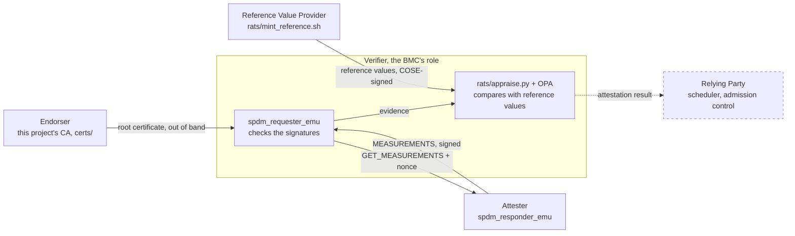
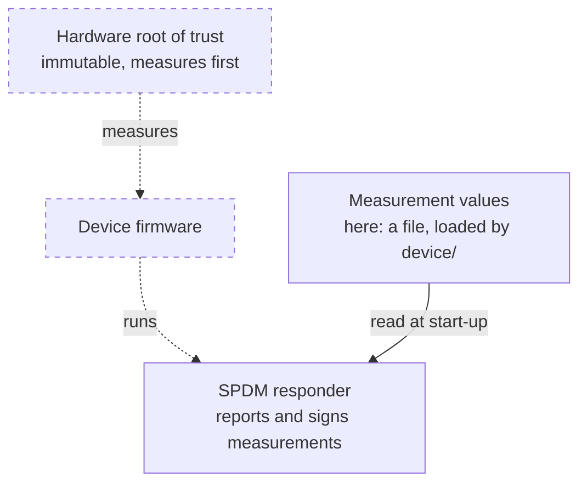
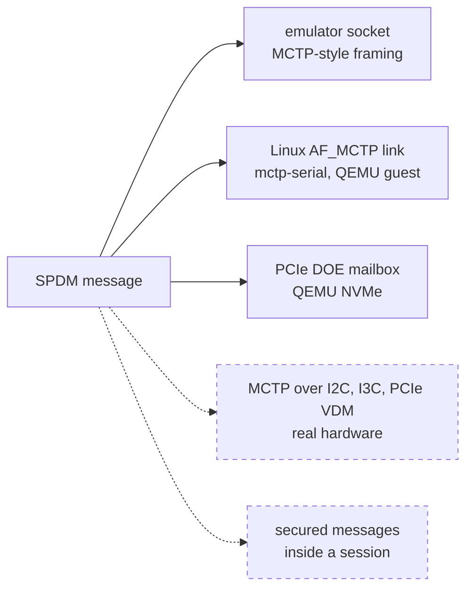
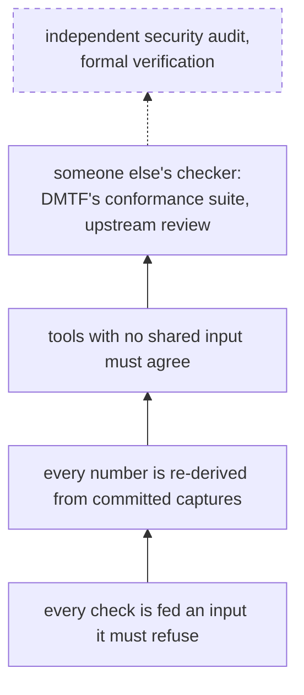
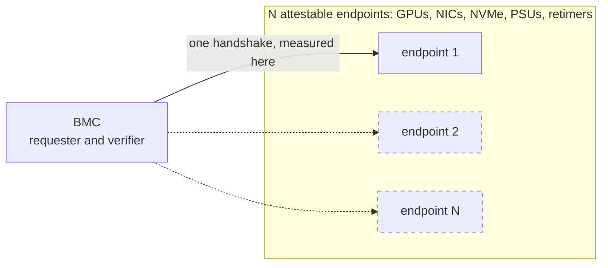

# SPDM Device Attestation Lab

DMTF's SPDM reference implementation (`libspdm`, `spdm-emu`), run end to end
and turned into numbers anyone can re-check: a full requester/responder
handshake, three places to change one byte and which layer notices each, a RATS
verifier that compares the measurement with a reference value, and the cost of
post-quantum signatures on the wire.

> **Scope. This project performs protocol-level correctness validation.**
> **It is not a security assessment.**
>
> It answers "does this flow behave as specified, and what does it cost in bytes
> and round trips". It does not answer "is this system secure". What is and is
> not claimed is in [`docs/threat-scope.md`](docs/threat-scope.md); what I did
> not do is in [`docs/limitations.md`](docs/limitations.md).


**Upstream:** [`DMTF/spdm-emu` #524](https://github.com/DMTF/spdm-emu/pull/524)
and [`openbmc/spdm` 94773](https://gerrit.openbmc.org/c/openbmc/spdm/+/94773),
both open. The full record, including a −1 and what it changed, is in
[`docs/upstream/`](docs/upstream/README.md).

## What one changed byte does

| # | what was changed | who notices | result | status the requester printed |
|:-:|---|---|---|---|
| — | nothing (the control) | — | handshake completes | — |
| 1 | a measurement value on the device, before it is signed | nobody in SPDM; the RATS verifier does | handshake completes, verdict **FAIL** | none |
| 2a | the measurement record, in flight | the measurement signature | refused after `MEASUREMENTS` | `80020001` `VERIF_FAIL` |
| 2b | the signature, in flight | the measurement signature | refused after `MEASUREMENTS` | `80020001` `VERIF_FAIL` |
| 3 | a certificate the device serves | the device itself | no `CERTIFICATE` is ever sent | `8001000a` `ERROR_PEER` |
| 3b | whose chain it is, not its bytes | the requester's authority check | handshake completes | only a warning |

_Table 1, condensed from [`docs/tamper.md`](docs/tamper.md). Rows 2a and 2b
print the same status for opposite reasons, and row 1 is invisible to SPDM by
design, which is why the verifier exists. SPDM 1.4, ECDSA P-384 with SHA-384,
measurements hashed with SHA-512 — read back from `ALGORITHMS` in the control
capture rather than from the flags.
`spdm-emu` `5f01d2f` and `libspdm` `8a92317` (4.0.0-rc) with this project's
measurement-source patch. Captures and manifests:
[`bench/data/w5-tamper-20260910T092621Z/`](bench/data/w5-tamper-20260910T092621Z/)._

## Check it in five minutes

| to check that | time | how |
|---|---|---|
| the code runs | 10 s | the badge above. Each CI job states what it protects, and what it does not, in [`ci.yml`](.github/workflows/ci.yml) |
| the numbers are real | 90 s | `bash harness/verify_repo.sh` re-derives every published number from the committed captures, with zero tolerance. That includes the numbers on this page, which carry markers the same run checks |
| the packets are real | 60 s | the `.pcap` files under [`bench/data/`](bench/data/) are the raw captures, and each run directory has a `manifest.json` with its commands, upstream commits and file hashes |
| a tamper is still caught | 10 s | `python3 rats/appraise.py matrix --check`: ten arms, each with the verdict it must get. The `rats` CI job fails if any of them changes, row 1 of the table above included |
| I can read the protocol | 90 s | [`docs/handshake-walkthrough.md`](docs/handshake-walkthrough.md), the handshake message by message, with its numbers checked against a capture |
| I have run someone else's test suite | 60 s | [`docs/validator-report.md`](docs/validator-report.md): DMTF's conformance suite run four ways, and which of its failures were its own |
| I know where this stops | 90 s | [`docs/limitations.md`](docs/limitations.md) |

## Run it

```bash
git clone https://github.com/Jhongwe1/mctp-spdm-pqc && cd mctp-spdm-pqc

bash harness/verify_repo.sh              # ~90 s, no build: everything CI checks
python3 rats/appraise.py matrix --check  # needs opa: the ten RATS verdicts

bash harness/doctor.sh                   # prerequisites; changes nothing
bash harness/build_spdm_emu.sh pqc       # ~30 min: the pinned upstream build
bash harness/healthcheck.sh pqc          # one handshake, captured and checked
```

[`RUNBOOK.md`](RUNBOOK.md) is the step-by-step version, in Chinese, and says
what correct output looks like at every step.

---

## 1. Why I built this

SPDM lets a BMC ask a device for its firmware measurements, and it proves two
things about the answer: it came from the key the device holds, and nothing
changed it on the way. It does not say whether the measurement is the right one.
I built this lab to see that gap in real packets and real verdicts rather than
in a specification, and to measure what the post-quantum signatures that
`libspdm` gained in 2026 cost on the same link.

## 2. Architecture

Five diagrams, each answering one question. **Solid** means built here and
backed by evidence in this repository. **Dashed** means understood from the
specification or from upstream, and not built or not measured here.

### A. Who asks whom for what



SPDM specifies the two arrows between the requester and the attester, and
nothing else. The Endorser and the Reference Value Provider are played by this
project's own keys; a real system uses the silicon vendor's PKI and the firmware
publisher's release metadata. There is no Relying Party: the verdict ends as an
exit code that CI asserts. [`docs/rats-roles.md`](docs/rats-roles.md)

### B. Who measures the measurer



In a real device each stage is measured by the one before it, starting from
something that cannot be changed. In this lab the chain stops at a file: the
responder reports whatever `device/` loads. That is deliberate. It makes row 1
of Table 1 easy to produce, and it is also the reason nothing here says anything
about a real root of trust.

### C. How an SPDM message reaches the other side



Most captures use the emulator's socket, which frames messages the way MCTP
does and is not an MCTP network. Week 9 ran both arms of the post-quantum
comparison over a real Linux MCTP link, where the post-quantum handshake needs
<!--xclaim mctp_packet_ratio_level3_meas_op_all=8.29-->**8.29×** as many
packets, counted off the wire. The DOE mailbox carried one `GET_VERSION` and
nothing more. None of the arms a number rests on opens a secure session; two
committed captures do, and nothing is measured from either (section 6, the
last mistake). [`docs/transports.md`](docs/transports.md)

### D. How I check my own results



The lower layers run on every push. The top solid layer is the only one I do
not control, and it has disagreed with me in both directions: the conformance
suite reported <!--xclaim validator_baseline_failures=8-->8 failures, of which
four were the suite's own, and an upstream reviewer found a policy my research
had concluded did not exist. The dashed layer is what a security assessment
would add.

### E. What it costs on a real server



<!-- capture: bench/data/w8-pqc-matrix-20260914T131557Z/A0-all.decode.txt -->

Measured per endpoint: the post-quantum handshake is
<!--xclaim pqc_handshake_ratio_level3_meas_op_all=8.99-->**8.99×** the bytes of
the classical one at NIST category 3, and a build with SLH-DSA compiled in
advertises a
<!--claim capabilities.responder.max_spdm_msg_size=163840-->163,840-byte message
buffer before any algorithm is chosen, even in its ECDSA handshakes. Not
measured: the bus round-trip time and the BMC's verification time, which is
where boot time goes. The model and what is missing from it are in
[`docs/pqc-cost.md`](docs/pqc-cost.md) §11. The multiplier is N, and on an
8-GPU server N is a few dozen.

## 3. Build and versions

Everything runs on Ubuntu 24.04 (WSL2 here). Upstream source is never copied
into this repository: [`third_party/*.pin`](third_party/) records the exact
commits, and `harness/build_spdm_emu.sh` rebuilds from them.

| flavor | `spdm-emu` / `libspdm` | used for |
|---|---|---|
| `stable` | 3.8.0 / 3.8.0 | the released-pair control |
| `pqc` | 4.0.0-rc (`5f01d2f` / `8a92317`) | every comparison arm, classical and post-quantum |
| `pqc-dts` | 4.0.0-rc, larger buffers and a 55-line patch | the DataTransferSize sweep only |

Every arm of a comparison comes from one build, so the algorithm is the only
variable. The vendored OpenSSL is 3.5.5, and it is the one that computes every
signature; the host's own is 3.0.13 and has no ML-DSA.
[ADR 0001](docs/decisions/0001-two-build-flavors.md) and
[ADR 0009](docs/decisions/0009-a-third-build-flavor.md) have the reasoning.

## 4. What I did, and what I did not

| mine | upstream's |
|---|---|
| the tamper harness and the in-flight proxy that changes one byte | the SPDM handshake, chunking, the transcript |
| the analysers: `pcapstat.py`, `fields.py`, `pcapcount.py`, `challenge_verify.py` | the post-quantum algorithms (`libspdm` 4.0, OpenSSL 3.5.5) |
| the RATS pipeline: reference values, policy, verdict (`rats/`) | the responder validator and the fuzz targets |
| the negative suite: three advisory classes, 21 deliberately wrong implementations | `libspdm`, `spdm-emu` and `spdm-dump` themselves |
| the CI that goes red when a tampered measurement is accepted | |
| two upstream changes | |

The accurate verbs are "I measured it" and "I connected it up". I did not
implement SPDM, and I did not add post-quantum support.

| not done | why |
|---|---|
| implement SPDM | the value here is checking the reference implementation, not writing a second one nobody can verify |
| implement ML-DSA or ML-KEM | cryptographic primitives are for specialists; this uses the OpenSSL that `libspdm` vendors |
| change `libspdm`'s protocol logic | a patched library measures my code, not upstream's. The two patches here change where a measurement value comes from (`device/`) and make DataTransferSize settable (a separate build) |
| real hardware | no board. Emulators and QEMU throughout |
| measuring a secure session | no measured arm opens one. Two captures hold sessions, the week-1 run by accident and DMTF's conformance suite on purpose, and I measured nothing from either, so nothing is claimed about session keys or encrypted records |
| timing | two processes on one host measure scheduling, not cryptography. No latency number is published |
| side channels, fault injection | they need equipment and a method I do not have |

## 5. Measurements and evidence

Table 1 is above. Table 2 is what post-quantum authentication costs, with the
algorithm read back from the capture of every arm:

| arm | signature bytes, from the wire |
|---|--:|
| A0 ECDSA P-384 | <!--xclaim signature_bytes_ecdsa_p384_from_the_wire=96-->96 |
| A1 ECDSA P-521 | <!--xclaim signature_bytes_ecdsa_p521_from_the_wire=132-->132 |
| P1 ML-DSA-44 | <!--xclaim signature_bytes_ml_dsa_44_from_the_wire=2420-->2,420 |
| P2 ML-DSA-65 | <!--xclaim signature_bytes_ml_dsa_65_from_the_wire=3309-->3,309 |
| P3 ML-DSA-87 | <!--xclaim signature_bytes_ml_dsa_87_from_the_wire=4627-->4,627 |
| S1 SLH-DSA-SHA2-128s | <!--xclaim signature_bytes_slh_dsa_sha2_128s_from_the_wire=7856-->7,856 |

| handshake bytes, post-quantum ÷ classical | `--meas_op ALL` | `ONE_BY_ONE` |
|---|--:|--:|
| NIST category 3: ML-DSA-65 ÷ ECDSA P-384 | <!--xclaim pqc_handshake_ratio_level3_meas_op_all=8.99-->8.99× | <!--xclaim pqc_handshake_ratio_level3_meas_op_one_by_one=6.01-->6.01× |
| NIST category 5: ML-DSA-87 ÷ ECDSA P-521 | <!--xclaim pqc_handshake_ratio_level5_meas_op_all=10.91-->10.91× | <!--xclaim pqc_handshake_ratio_level5_meas_op_one_by_one=7.55-->7.55× |

Each signature length is the difference between two message sizes, and every
one lands exactly on its FIPS 204, FIPS 205 or SEC 1 size. The certificate chain
alone grows
<!--xclaim pqc_certchain_ratio_mldsa65_vs_ecdsa384=10.18-->10.18×, and the
negotiation is byte-identical in all six groups
(<!--xclaim vca_bytes_spread_across_all_six_groups=0-->0 bytes apart). A ratio
is a property of a workload, so both measurement flows are shown. Details and
the full table: [`docs/pqc-cost.md`](docs/pqc-cost.md).


**The comparison is single-variable, and that is checked rather than intended.**
Arms A0 and P2 differ only in the last two lines below; everything above them is
identical in both. And the run fails if `ALGORITHMS` on the wire does not show
what the arm declared:

```diff
  controlled, identical in both arms:
    --ver 1.4 --sec_ver 1.2 --hash SHA_384 --meas_hash SHA_384 --aead AES_256_GCM
    --other_param OPAQUE_FMT_1 --key_schedule HMAC_HASH --meas_att HASH
    --meas_sum ALL --slot_count 1 --slot_id 0 --exe_conn DIGEST,CERT,CHAL,MEAS
    --exe_session NO_END --basic_mut_auth NO --mut_auth NO
    --req_asym ECDSA_P384 --req_pqc_asym NONE --meas_op ALL
- A0:  --asym ECDSA_P384  --dhe SECP_384_R1  --pqc_asym NONE       --kem NONE
+ P2:  --asym NONE        --dhe NONE         --pqc_asym ML_DSA_65  --kem ML_KEM_768  --pqc_first TRUE
```

From
[`A0-all.cmdline.txt`](bench/data/w8-pqc-matrix-20260914T131557Z/A0-all.cmdline.txt)
and
[`P2-all.cmdline.txt`](bench/data/w8-pqc-matrix-20260914T131557Z/P2-all.cmdline.txt).
Rebuild every figure from the data with `python3 harness/mkfigures.py`, and see
every cross-capture number with its derivation with
`python3 harness/check_claims.py --show`.


Other results, each with its evidence:

- **DataTransferSize** is a latency parameter that looks like a bandwidth one:
  across a 32× range, bytes move by a few percent and chunk round trips go from
  <!--xclaim dts_sweep_chunk_roundtrips_at_the_smallest=59-->59 to none.
  [`docs/pqc-cost.md`](docs/pqc-cost.md) §9,
  [Figure 3](figures/fig3-datatransfersize.svg).
- **Conformance.** Clearing one capability bit moved
  <!--xclaim validator_assertions_unlocked_by_one_capability_bit=611-->611
  assertions of DMTF's suite from not-executed to executed.
  [`docs/validator-report.md`](docs/validator-report.md).
- **RATS.** Ten arms, and the verdict for each is asserted by CI.
  [`docs/rats-pipeline.md`](docs/rats-pipeline.md).
- **Advisories.** Whether this project's own builds carry the three 2026
  `libspdm` advisories, measured five ways each: one of the two flavors does.
  [`docs/advisories.md`](docs/advisories.md).

## 6. Mistakes I made, and what they taught me

Five of them, each told as it happened: what I saw, what I thought it might be,
which guess I tested first and why, what it was, and what I do differently now.
The numbers here are history, quoted from [`LOG.md`](LOG.md), not claims CI
re-derives.

**The minimal handshake was not minimal (week 1).** `--exe_conn
DIGEST,CERT,CHAL,MEAS` should have been the smallest useful flow. It produced
1,116 packets in 53 seconds and exited 1
([the run](bench/data/healthcheck-pqc-20260811T052725Z/), kept on purpose). I
suspected the sample keys, the flag
not parsing, or something outside that flag running. I checked the parse first,
because one line of output settles it and nothing else matters if the flag did
not take. It had parsed. The cause was a second flag, `--exe_session`, whose
default runs fourteen more operations inside an encrypted session, one of which
fails on the sample keys. Set to `NO_END`, the same flow was 554 packets and
exited 0. **An exit code answers the question the program was asked, not the one
I meant**, so `harness/healthcheck.sh` now checks the capture and the log, not
only `$?`. And flag semantics come from the source, not from `--help`.

**A ratio I recorded and then withdrew (week 1).** Classical against
post-quantum came to 5.94× the bytes. The algorithms in that sentence were the
ones I had requested. So before anything else I read back what was negotiated,
from `ALGORITHMS` in both captures, because that is the claim the ratio rested
on. The negotiation was right. The comparison still was not: the classical run
spent 246 messages on errors from a measurement-index probe, and the
post-quantum decode stopped at packet 18 because the decoder has a compile-time
limit on chain size. The two captures did not contain the same operations.
**Single-variable is something you prove from both captures, not something you
intend**, and every published ratio now comes from arms whose control flags are
pinned in one list and whose negotiation is read back, or the run fails.

**The test case that separated nothing (week 9).** A document said a 177-byte
message separates the right MCTP packet formula from a plausible wrong one.
Writing a table, I computed the wrong formula's answer: `ceil(177/59)` is 3,
which is also the right one's. `59 × 3 = 177`. I suspected I had the rival
formula wrong, then that the test checked something else. Neither: the rival
was never written as code, so the test only confirmed that the right formula
gave the right answer. **A claim that two things differ has to evaluate both of
them.** The rival is now a function, the separating lengths are computed, and
every capture reports how many of its messages actually discriminate.

**The conformance suite said my responder was wrong, and the suite was wrong
(week 10).** DMTF's `SPDM-Responder-Validator` reported four `response
signature` failures. A bad signature, a capability mismatch, or a bug in the
suite. I tested none of them first. I looked for the fact that separates them,
and it was free: the cases that fail are exactly the ones that never fetch the
certificate, while fetching digests changes nothing. Then, rather than
publishing a mechanism read out of source, I rebuilt each signed transcript from
the capture and asked OpenSSL. The tool calibrates first, on the nine
connections the suite passes, and only then answers for the disputed ones.
Every one verifies. **When an instrument disagrees with the thing it measures, the
instrument is a hypothesis too**, and a calibration step is what turns a tool's
verdict into evidence.

**A census of the captures somebody chose to decode (week 12).** Seven documents
said no secure session had ever been established here, and so did the reason
one tool gave for an advisory verdict. Rewriting this README, I found a
claim's description mentioning `KEY_EXCHANGE_RSP`. I suspected the validator's
key exchanges had all aborted, as its report says for the default arm; or that
one arm had completed them; or that my evidence did not cover what I thought.
The third was cheapest to test, so I counted: 132 of 152 committed captures had
a decode, and every "no session" sentence rested on those. Decoding the other
20 found two completed sessions, one of them in the week-1 run cited above, at
SPDM 1.4 with 552 encrypted records. **A claim about "every capture" is a claim
about the captures you read.** `harness/census.sh` now reads all of them, and
`verify_repo.sh` fails if a capture is added that nothing reads.

## 7. Limitations

The short version. The long one, in six layers, is
[`docs/limitations.md`](docs/limitations.md).

- **No real device.** The responder is an emulator, its keys are files, and its
  measurement values are loaded from a file.
- **Numbers from x86, not from a BMC.** Byte and packet counts transfer.
  Performance does not, and none is published.
- **The reference values are mine.** A real verifier takes them from the
  firmware publisher, and nothing here handles their revocation or rotation.
- **The version rule has a direction.** Accepting "not lower than the
  reference" refuses a rollback below it. It accepts a rollback that stays
  above it, and an attacker-built image that simply carries a higher number.
- **No session measured, no side channels, no formal analysis.** Each is out of
  scope, and each is named where it would matter.
- **Upstream moves.** Every number is tied to the commits in `third_party/`,
  and a newer `libspdm` has to be measured again.

## 8. References

**Specifications, pinned** in [`third_party/`](third_party/) with the SHA-256
of the copy that was read:

- DMTF DSP0274, SPDM, **1.4.0** and **1.4.1**. Both, because the third advisory
  is a defect in 1.4.0's text: the `FINISH` transcript definition, which 1.4.1
  rewrote ([`docs/transcript.md`](docs/transcript.md)).
- The SPDM 1.5 post-quantum hybrid public review draft, June 2026
  ([`docs/upstream/spdm15-hybrid-feedback.md`](docs/upstream/spdm15-hybrid-feedback.md)).

**Cited for one fact each, not pinned:** DSP0236 (MCTP base) for the 64-byte
baseline transmission unit; DSP0253 (MCTP serial binding) for the framing of
the QEMU link; RFC 9334 for the RATS roles; FIPS 204 and 205 for the ML-DSA and
SLH-DSA signature sizes the wire is checked against; FIPS 203 only for ML-KEM's
security category, because no ML-KEM key exchange ever reached the wire. The
two sessions that did were ECDHE P-384.

**Upstream code**, by commit: `spdm-emu` `5f01d2f` and `libspdm` `8a92317`
(4.0.0-rc); the `stable`, `pqc-dts`, `spdm-dump`, QEMU, Linux and OPA pins are
beside them in `third_party/`.

**Advisories** against `libspdm`, each pinned at the repository advisory URL
that resolves (the global advisory database has none of them):
[DMTF-2026-0001](https://github.com/DMTF/libspdm/security/advisories/GHSA-j54w-759w-xj3m),
[DMTF-2026-0002](https://github.com/DMTF/libspdm/security/advisories/GHSA-m4wc-xmvg-369f),
and
[DMTF-2026-0003](https://github.com/DMTF/libspdm/security/advisories/GHSA-chjj-xvqx-c8w4),
the only one with a CVE, CVE-2026-61810.
[`docs/advisories.md`](docs/advisories.md) has what checking them found.

## Status

This is week 12 of a 14-week programme. The table is what exists today; the
plan is in [`docs/roadmap.md`](docs/roadmap.md), and what each week established
is in [`docs/progress.md`](docs/progress.md).

| Gate | Subject | State |
|:--|---|---|
| G0 | environment and version baseline | **complete** — [`docs/env-baseline.md`](docs/env-baseline.md) |
| G1 | full handshake, field by field | **complete** — seven message pairs, their numbers checked against a capture ([`docs/handshake-walkthrough.md`](docs/handshake-walkthrough.md)) |
| G2 | certificate chain, three tamper points | **complete** — Table 1 ([`docs/tamper.md`](docs/tamper.md)) |
| G3 | RATS verification pipeline | **complete** — Table 3 ([`docs/rats-pipeline.md`](docs/rats-pipeline.md)) |
| G4 | post-quantum cost quantification | **complete** — Table 2 and Figures 2 and 3 ([`docs/pqc-cost.md`](docs/pqc-cost.md)) |
| G5 | real transports (QEMU / AF_MCTP) | **complete** — Table 4 ([`docs/transports.md`](docs/transports.md)) |
| G6 | conformance and negative testing | **complete** — [`docs/validator-report.md`](docs/validator-report.md), [`docs/negative-tests.md`](docs/negative-tests.md), [`negative/`](negative/) |
| G7 | upstream contribution | **in progress** — two changes sent, one of them reviewed, neither merged ([`docs/upstream/`](docs/upstream/README.md)) |
| G8 | delivery and write-up | **in progress** — this README, [`docs/threat-scope.md`](docs/threat-scope.md) and [`docs/limitations.md`](docs/limitations.md) in week 12; weeks 13 and 14 remain |

## How this was built

Much of the code and prose here was written with an AI coding assistant, Claude
Code, in sessions I directed. Commits from 2026-09-10 on say so in a
`Co-Authored-By:` trailer. The 107 commits before that date do not carry it,
and its absence there is not a claim that no assistant was involved. Three
things do not depend on trusting either of us:

- Every number is re-derived by CI from the committed captures, and every
  capture's `manifest.json` records the commands and upstream commits that made
  it.
- Facts are checked against primary sources, meaning the upstream code, the
  pinned specification PDFs and the advisory pages, and not against anyone's
  memory. `docs/roadmap.md` standing rule 7.
- `c-drills/` is the exception, on purpose. Its tests are the specification and
  its implementations are written by hand without an assistant, because they
  measure me rather than the system. `c-drills/DONE.txt` lists the finished
  ones.

Upstream projects set their own rules for AI assistance, and my first OpenBMC
change was reviewed under them; [`docs/upstream/`](docs/upstream/README.md) has
what that changed.

## Repository layout

```
harness/       build, capture, tamper, analysis, and verify_repo.sh (what CI runs)
bench/         pcapstat.py, claims.json, and data/: one directory per run, each
               with the captures and a manifest.json
rats/          reference values, the OPA policy, and the appraisal
device/        where a measurement value comes from, and the patch that reads it
certs/         this project's own three-level certificate chain and its checker
negative/      the three advisory classes as tests, against wrong implementations
transport/     real-transport glue: the MCTP link, the DOE probe, one patch
figures/       generated by harness/mkfigures.py, never drawn by hand
docs/          one document per result, decision records, upstream records
c-drills/      eight C exercises drawn from problems this project hit
third_party/   upstream commit and document pins; no vendored source
```

## Licence

Original work here is under the licence in [LICENSE](LICENSE). `libspdm`,
`spdm-emu` and `spdm-dump` are DMTF projects under their own licences and are
referenced by commit, not copied.
