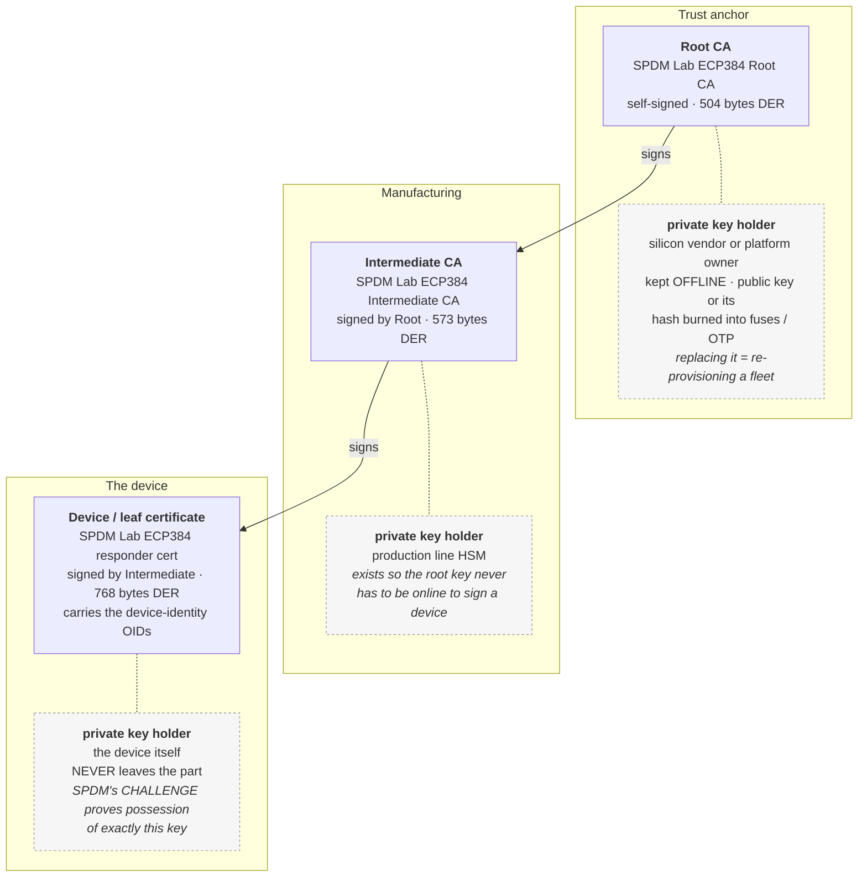

# The certificate chain

What SPDM's `CERTIFICATE` message actually carries, who holds which private key,
and what this project's own chain measured when it replaced the reference one.

Every number below is re-derived from a capture by `harness/fields.py --check`
on every CI run. Sources: DSP0274 1.4.0 (`sha256
a2035c64f614640ba34133ad255589269bf13c9d816414638fb22d89eb5369d9`), and the
pinned `libspdm` / `spdm-emu` trees named in `third_party/*.pin`.

<!-- capture: bench/data/w4-baseline-20260901T054208Z/selfsigned.decode.txt -->

---

## Figure 1 — three layers, and who holds each private key

The layer boundaries are not organisational. Each one exists because a
different party holds the key, in a different place, with a different blast
radius when it is lost.



**Read the diagram by asking what an attacker gets.** The leaf key compromises
one device. The intermediate key lets an attacker mint certificates for devices
that do not exist, but the root can revoke the intermediate. The root key is the
one that cannot be recovered from in software, because its public key is in
fuses — which is the entire reason it is not the key that signs devices.

**The middle layer is not decoration, and it is not "best practice".** It is the
answer to a scheduling problem: a production line has to sign a certificate for
every part it makes, thousands a day, and the key that does that has to be
reachable by the line. A trust anchor that must be reachable by a factory floor
is not an anchor. So the root signs one thing, once, and goes offline.

---

## What goes on the wire

DSP0274 1.4.0 Table 39. The chain is not a bare concatenation of certificates —
it has a header the responder builds at run time:

```
offset  field          size          this project's chain
------  -----------    -----------   --------------------
     0  Length         4 (LE)        1897
     4  RootHash       H = 48        df0ee8f9 0256c1d5 8bc991ae …  (SHA-384)
    52  Certificates   Length-(4+H)  504 + 573 + 768 = 1845
```

so

```
4 + 48 + 1845 = 1897
```

<!--claim layout.certificate.chain_length=1897--> **1,897 bytes**, and
`certs/check_chain.py` computes that from the files on disk *before* a handshake
runs, while `harness/fields.py` reads it back out of the capture without ever
opening a certificate. The two share no input. Individual certificate sizes,
recovered from the wire by walking DER:
<!--claim layout.certificate.certificate_bytes=504,573,768--> **504, 573, 768**,
summing to <!--claim layout.certificate.certificates_bytes_total=1845--> **1,845**.

`RootHash` is the digest of the *root* certificate, which here is also the first
certificate in the chain — and that is checked rather than assumed:
<!--claim layout.certificate.root_hash_matches_first_certificate=True--> **true**.
DSP0274 permits a chain whose root is not among its certificates, so this is an
observation about this chain, not a property of all chains.

The message wrapping it is <!--claim layout.certificate.total_bytes=1913-->
**1,913 bytes** = 16 header + 1,897, and the full field-by-field reading is in
[`handshake-walkthrough.md`](handshake-walkthrough.md) §5.

---

## The two device-identity OIDs

A leaf certificate that says only `CN=some device` identifies a *name*. What
attestation needs is a certificate that identifies a *part*. Two specifications
answer that, and they answer it separately.

### `1.3.6.1.4.1.412.274.1` — `id-DMTF-device-info`

DSP0274 1.4.0 §425 defines it exactly:

```
id-DMTF             OBJECT IDENTIFIER ::= { 1 3 6 1 4 1 412 }
id-DMTF-spdm        OBJECT IDENTIFIER ::= { id-DMTF 274 }
id-DMTF-device-info OBJECT IDENTIFIER ::= { id-DMTF-spdm 1 }

DMTFOtherName ::= SEQUENCE {
    type-id   DMTF-oid
    value [0] EXPLICIT ub-DMTF-device-info
}
DMTF-device-string  ::= UTF8String (ALL EXCEPT ":")
ub-DMTF-device-info ::= UTF8String({ DMTF-manufacturer ":"
                                     DMTF-product ":"
                                     DMTF-serialNumber })
```

Three colon-separated fields, and no field may contain a colon — which is what
makes the separator unambiguous without a length prefix. This project's leaf
carries `SPDM-Lab:emulated-responder:0000000001`. The reference implementation's
carries `ACME:WIDGET:1234567890`.

§414 makes it **recommended, not mandatory**: *"the Subject Alternative Name
certificate extension otherName field is recommended for providing device
information."* And §1407 is stronger about why — *"Though existing deployments
might not include the Hardware identity OID in a certificate, it is strongly
recommended that new deployments include this information."*

The leaf also carries `id-DMTF-hardware-identity` (`{ id-DMTF-spdm 2 }` =
`1.3.6.1.4.1.412.274.2`) inside `id-DMTF-spdm-extension` (`…274.6`), copied
unchanged from the reference implementation's own leaf. DSP0274 §10.9.2.2.1: it
marks which certificate in a chain is the one bound to hardware, regardless of
whether the DeviceCert or AliasCert model is in use, and it *shall not* appear
in an alias certificate.

### `2.23.147` — PCI-SIG device identity

`plan/W03` §2.2 states that PCIe r6.1 §6.31.3 requires a CMA/SPDM endpoint's
leaf certificate to carry an `otherName` under this OID holding

| field | meaning |
|---|---|
| `Vendor` | PCI Vendor ID |
| `Device` | PCI Device ID |
| `CC` | Class Code |
| `REV` | Revision |
| `SSVID` | Subsystem Vendor ID |
| `SSID` | Subsystem ID |

**This is not verified.** The PCIe Base Specification is behind PCI-SIG
membership and was not read for this repository. What *was* checked is that the
string `2.23.147` appears **zero** times in DSP0274 1.4.0's 306 pages and
**zero** times in the pinned `libspdm` and `spdm-emu` source trees. Nothing in
this project's toolchain reads it, requires it, or would notice if it were
wrong.

It is carried because W09's QEMU DOE path is said to need it and it costs
nothing to add now rather than after a day of debugging. The values name QEMU's
virtual NVMe controller — `1b36` is Red Hat/QEMU's PCI vendor ID, `0010` its
NVMe device ID, class code `010802` is mass-storage / NVM / NVMe — because that
is the W09 target and a plausible value is easier to check than a placeholder.

### The attack this addresses, stated carefully

Without a device-identity binding, a certificate says *this key belongs to
something this CA vouched for*. It does not say *which* something. So an
attacker with physical access, or with a supply-chain position, can present a
**genuine, unexpired, correctly signed certificate from the same vendor** that
belongs to a cheaper part, and a verifier checking only the chain will accept
it. The measurements that follow would then be the cheap part's measurements,
correctly signed, and every cryptographic check would pass.

The binding turns "signed by a CA I trust" into "signed by a CA I trust, *and*
claiming to be the part I think I am talking to" — which the verifier can
compare against what the slot inventory says should be there.

Two limits worth stating in the same breath. This is only as good as the
verifier's willingness to *reject* a mismatch, and the RATS policy that does
that is Gate 3, not this week. And it does not defend against an attacker who
can extract the leaf private key from the part it belongs to; nothing at this
layer does. See [`threat-scope.md`](threat-scope.md).

---

## Slots

DSP0274 §373: *"A device shall not contain more than eight slots. Slots are
numbered 0 through 7 inclusive."* §374: slot 0 is the default and shall hold a
valid chain unless the device has not been provisioned yet.

**Why eight and not one: rotation.** A trust anchor cannot be replaced
instantaneously across a fleet — some verifiers will have the new root and some
will still have the old one, and the window between them is measured in
quarters, not seconds. Multiple slots let a device present a chain under the old
anchor and a chain under the new one at the same time, so the rotation has no
moment at which nothing validates. The second common use is multi-tenancy: one
part, several customers or regions, each with its own anchor.

`SlotID 0xFF` means the chain is **pre-provisioned** — the requester already
holds it and `GET_CERTIFICATE` is skipped entirely. That is the lever worth
remembering for Gate 4: a post-quantum chain measured at 16,853 bytes and four
chunking round trips costs nothing at all if the verifier already has it. Which
is also why `GET_DIGESTS` exists, and why its 48-byte-per-slot cost stops being
an optimisation and starts being the mechanism (see
[`handshake-walkthrough.md`](handshake-walkthrough.md) §4).

**libspdm 4.0.0-rc does not implement slot management.** Its release note lists
`DSP0274 1.4 - Slot Management` as *still not supported*. So the slots visible
in these captures are the sample responder's fixed provisioning, not something
this project drove.

What these captures actually show: the responder reports
<!--claim layout.digests.provisioned_slot_mask=0x13--> `0x13` — slots 0, 1 and
4, which are **not contiguous** — carrying
<!--claim layout.digests.slots=3--> **3** digests of
<!--claim layout.digests.per_slot_bytes=52--> **52 bytes** each.

---

## The finding this chain produced, which was not the one it was built for

The chain was built to be tampered with in Gate 2. Running it produced something
else first.

Replacing the responder's chain replaced **one of three** trust anchors that a
single mutually-authenticating handshake carries:

| packet | direction | slot | chain bytes | root | whose |
|--:|---|--:|--:|---|---|
| 10 | RSP→REQ | 0 | 1,897 | `df0ee8f9…` | **this project's** |
| 12 | RSP→REQ | 4 | 1,660 | `ed79ce9a…` | upstream, `ecp384/` |
| 19 | REQ→RSP | 0 | 3,794 | `e59ee211…` | upstream, `rsa3072/` |
| 26 | RSP→REQ | 0 | 1,897 | `df0ee8f9…` | **this project's** |

<!--claim layout.chains#=4--> **4** chain fetches,
<!--claim layout.distinct_root_hashes=3--> **3** distinct roots.

The requester's chain descends from a different root because SPDM negotiates the
requester's signature algorithm **separately**: `ReqAsym` settled on
`RSAPSS_3072`, and libspdm's sample device-secret library selects its
certificate directory from the negotiated algorithm — `rsa3072/`, which the
staging step never touched. Slot 4 is upstream's because `--slot_count` does not
depopulate the responder's slots, only the requester's.

**Why this matters outside an emulator.** A vendor provisioning "the device
certificate" is replacing the chain in one direction, for one slot, under one
algorithm. Every other combination keeps whatever was there — and on a reference
design, what was there is the reference implementation's sample chain, whose
private keys are published in the upstream repository. The failure is silent:
the handshake completes, every signature verifies, and nothing in the flow says
which anchor was used.

This is the same shape as 2026-08-17's finding, in a different mechanism: an
independent variable with more halves than were pinned. `fields.py` now reports
`layout.distinct_root_hashes` so the count is something CI checks rather than
something someone noticed.

---

## Reproducing

```bash
bash certs/gen_chain.sh                          # a DIFFERENT chain; see below
python3 certs/check_chain.py certs/out
python3 certs/check_chain.py certs/out --self-test
bash certs/stage_chain.sh pqc                    # prints the sandbox directory
bash harness/capture.sh --name w3-baseline
```

The certificates in `certs/out/` are committed; the private keys are not. A
fresh clone can therefore verify everything above but cannot take a *new*
capture with this chain — `gen_chain.sh --force` produces different keys, and an
ECDSA signature's DER length depends on whether its integers happen to have a
leading zero, so even the byte counts move. The chain is evidence; regenerating
it is the certificate equivalent of re-stamping a manifest, which
[`decisions/0004`](decisions/0004-derivations-must-reproduce.md) explains why
this repository does not do. `RUNBOOK.md` §8.7 says the same thing in the place
someone will hit it.
