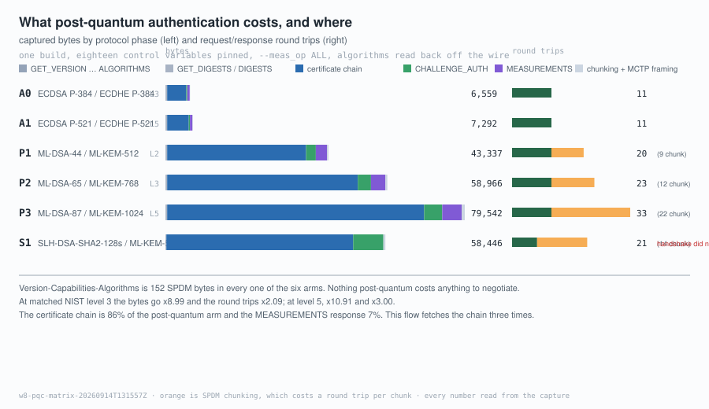
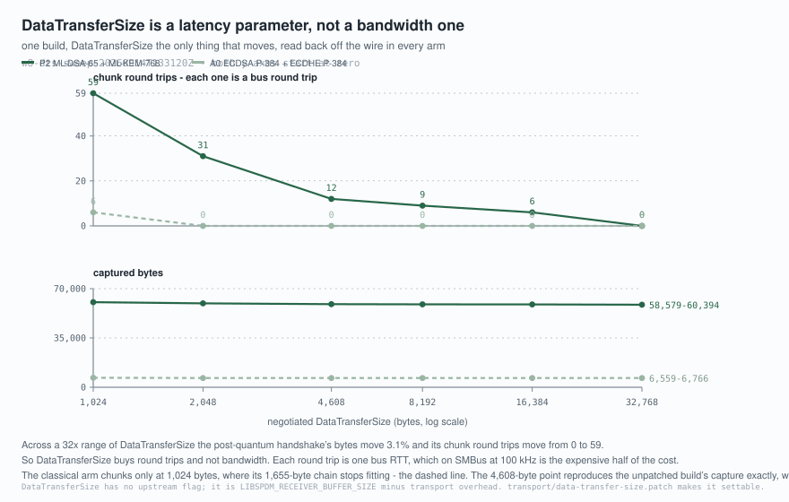

# What post-quantum authentication costs on the wire

> **I did protocol-flow level correctness validation, not a security
> assessment.** Nothing here says whether ML-DSA-65 is *safe*. It says how many
> bytes and how many round trips it takes, measured on one implementation, and
> what had to be held still for that measurement to mean anything.

Gate 4. Six algorithm groups, three matched comparisons, a DataTransferSize
sweep, and two figures. Reproduce all of it with:

```bash
bash harness/run_pair.sh                              # 20 arms, ~3 minutes
bash harness/run_pair.sh --set dts --flavor pqc-dts   # the sweep, 12 arms
python3 harness/check_claims.py                       # every ratio, re-derived
python3 bench/exp04_fragmentation.py --validate bench/data/w8-dts-sweep-*
python3 harness/mkfigures.py --check                  # the figures, from the data
```

---

## 1. What was compared, and against what

Six groups, arranged so each one is the other half of exactly one question.
Security categories are FIPS 203/204/205's, not this project's.

| arm | responder identity | key establishment | sig cat | kex cat |
|:--|---|---|:--:|:--:|
| **A0** | ECDSA P-384 | ECDHE P-384 | 3 | 3 |
| **A1** | ECDSA P-521 | ECDHE P-521 | 5 | 5 |
| **P1** | ML-DSA-44 | ML-KEM-512 | 2 | 1 |
| **P2** | ML-DSA-65 | ML-KEM-768 | 3 | 3 |
| **P3** | ML-DSA-87 | ML-KEM-1024 | 5 | 5 |
| **S1** | SLH-DSA-SHA2-128s | ML-KEM-512 | 1 | 1 |

- **A0 ↔ P2** — classical against post-quantum at matched category 3.
- **A1 ↔ P3** — the same question at matched category 5, so "the gap" can be
  shown to be a function of the security level rather than one anecdote.
- **P1 ↔ S1** — lattice against hash-based signatures, **same KEM**, so the only
  thing that moves is the signature family.

P1 → P2 → P3 is the within-family scaling, which is what decides whether 65 is a
knee point or just the middle row (§11).

Comparing ML-DSA-65 against ECDSA P-256 would measure a security-level change
and call it a post-quantum cost. `plan/W08` paired S1 with ML-KEM-768; at 768
the S1↔P1 comparison would move the KEM and the signature family at once and
answer neither question.

---

## 2. Table 2 — the measured cost

Run [`bench/data/w8-pqc-matrix-20260914T131557Z`](../bench/data/w8-pqc-matrix-20260914T131557Z),
2026-09-14. `spdm-emu` 4.0.0-rc `5f01d2f` / libspdm `8a92317`, **OpenSSL 3.5.5
vendored and statically linked** (`third_party/spdm-emu-pqc.pin`), SPDM 1.4,
`--meas_op ALL`, eighteen control variables pinned, twelve negotiated algorithm
groups read back off the wire and asserted per arm. Every cell comes from
`bench/pcapstat.py` reading the capture named in the run directory.

| arm | chain bytes | signature bytes | CHALLENGE_AUTH | MEASUREMENTS | total bytes | round trips | of which chunk | VCA bytes |
|:--|--:|--:|--:|--:|--:|--:|--:|--:|
| **A0** ECDSA-P384 | 1,655 | 96 | 238 | 594 | 6,559 | 11 | 0 | 152 |
| **A1** ECDSA-P521 | 1,877 | 132 | 274 | 630 | 7,292 | 11 | 0 | 152 |
| **P1** ML-DSA-44 | 12,266 | 2,420 | 2,562 | 2,918 | 43,337 | 20 | 9 | 152 |
| **P2** ML-DSA-65 | 16,853 | 3,309 | 3,451 | 3,807 | 58,966 | 23 | 12 | 152 |
| **P3** ML-DSA-87 | 22,727 | 4,627 | 4,769 | 5,125 | 79,542 | 33 | 22 | 152 |
| **S1** SLH-DSA-128s | 24,782 | 7,856 | 7,998 | — | 58,446 | 21 | 14 | 152 |

**S1 did not complete.** Its certificate chain is retrieved and verified and its
`CHALLENGE_AUTH` arrives with a correctly sized signature, and then the
requester exits 1. §12 isolates where. Its total is therefore a *partial*
handshake and is not comparable with the other five; it is in the table because
its chain and signature lengths are real measurements and deleting them would
lose the only hash-based data point this project has.

`CHALLENGE_AUTH` and `MEASUREMENTS` are the **reassembled** message lengths. In
P3 and S1 those messages exceed the negotiated DataTransferSize and arrive in
chunks; the number in the table is what they add up to, not what one chunk
carried. Round trips are request/response pairs, counted from the request-coded
message types.

Fourteen values in and around that table are bound to their captures so a machine
re-derives them on every build — `harness/fields.py --check`, reading
`spdm_dump`'s decode, which is a different route from the `bench/pcapstat.py` one
the table itself was built with:

<!-- capture: bench/data/w8-pqc-matrix-20260914T131557Z/A0-all.decode.txt -->
The classical chain is <!--claim certificate.responder_slot0_bytes=1655-->1,655
bytes, the negotiated identity algorithm is
<!--claim algorithms.negotiated.Asym=ECDSA_P384-->`ECDSA_P384` with
<!--claim algorithms.negotiated.PqcAsym=-->no post-quantum algorithm selected at
all, and the negotiated DataTransferSize is
<!--claim capabilities.responder.data_transfer_size=4608-->4,608 bytes.

<!-- capture: bench/data/w8-pqc-matrix-20260914T131557Z/A1-all.decode.txt -->
ECDSA P-521's chain is
<!--claim certificate.responder_slot0_bytes=1877-->1,877 bytes at
<!--claim algorithms.negotiated.Asym=ECDSA_P521-->`ECDSA_P521`.

<!-- capture: bench/data/w8-pqc-matrix-20260914T131557Z/P2-all.decode.txt -->
The category-3 post-quantum chain is
<!--claim certificate.responder_slot0_bytes=16853-->16,853 bytes, identity is
<!--claim algorithms.negotiated.PqcAsym=ML_DSA_65-->`ML_DSA_65`, key
establishment is <!--claim algorithms.negotiated.KEM=ML_KEM_768-->`ML_KEM_768`,
and <!--claim algorithms.negotiated.Asym=-->no classical signature algorithm was
selected.

<!-- capture: bench/data/w8-pqc-matrix-20260914T131557Z/P3-all.decode.txt -->
At <!--claim algorithms.negotiated.PqcAsym=ML_DSA_87-->`ML_DSA_87` the chain is
<!--claim certificate.responder_slot0_bytes=22727-->22,727 bytes, and at
<!-- capture: bench/data/w8-pqc-matrix-20260914T131557Z/S1-all.decode.txt -->
<!--claim algorithms.negotiated.PqcAsym=SLH_DSA_SHA2_128S-->`SLH_DSA_SHA2_128S`
it is <!--claim certificate.responder_slot0_bytes=24782-->24,782 — the largest
chain in the table, from the algorithm with the *lowest* security category.



---

## 3. Single-variable is a thing you prove, not a thing you intend

Eighteen flags are identical in every arm, and the list was read out of
`spdm_emu/spdm_emu_common/key.c` rather than out of `--help`. The defaults that
would otherwise have moved:

| default | value | what it would have done |
|---|---|---|
| `m_use_mut_auth` | `..._WITH_ENCAP_REQUEST` | mutual authentication ON |
| `m_use_basic_mut_auth` | `1` | and again, by a second route |
| `m_support_req_asym_algo` | four RSA algorithms | requester authenticates with RSA-PSS 3072 |
| `m_support_req_pqc_asym_algo` | ML-DSA 44, 65 and 87 | responder picks one of three for the requester |
| `m_use_slot_count` | `3` | `DIGESTS` grows with the slot count |
| `m_support_hash_algo` | SHA-384, SHA-256 | negotiated hash not determined by the flags |
| `m_support_measurement_hash_algo` | SHA-512, 384, 256 | measurement block size not determined either |
| `m_support_dhe_algo` | four groups | |
| `m_support_aead_algo` | two suites | |
| `m_support_other_params_support` | two bits | opaque data format |

Left alone, **every** arm would carry a requester RSA-3072 certificate chain the
experiment never asked for. In the 2026-08-28 baseline that chain is 4,460 bytes
of `DELIVER_ENCAPSULATED_RESPONSE` — 22% of the capture. It is identical in
every arm, so it cannot corrupt a *difference*; it dilutes every *ratio*, and a
reader asking "where did that RSA come from" would have had no answer.

The requester's own signature algorithm is **pinned rather than removed**, to
`ECDSA_P384` in every arm. `--req_asym NONE --req_pqc_asym NONE` — which is what
this project's own week plan specified — parses, echoes back, and then makes the
handshake impossible: the responder requires exactly one requester signature
algorithm whenever `MUT_AUTH_CAP` is supported, and `--mut_auth NO` is flow
policy that does not clear that capability bit. Nothing signs with the pinned
value — the captures carry no encapsulated exchange and zero requester chain
bytes, which `harness/lib/check_negotiated.py` asserts per arm — and all it puts
on the wire is one 4-byte `AlgStructure` entry, byte-identical across the matrix.
The libspdm source that requires it is quoted in full in
[`upstream/README.md`](upstream/README.md), candidate 13.

**The proof that it worked is the per-message table, not the flag list.** Every
message that is not the experiment is byte-identical across all six arms:

| message | A0 | A1 | P1 | P2 | P3 | S1 |
|---|--:|--:|--:|--:|--:|--:|
| `SPDM_GET_VERSION` / `VERSION` | 4 / 8 | 4 / 8 | 4 / 8 | 4 / 8 | 4 / 8 | 4 / 8 |
| `SPDM_GET_CAPABILITIES` / `CAPABILITIES` | 20 / 20 | 20 / 20 | 20 / 20 | 20 / 20 | 20 / 20 | 20 / 20 |
| `SPDM_NEGOTIATE_ALGORITHMS` | 48 | 48 | 48 | 48 | 48 | 48 |
| `SPDM_ALGORITHMS` | 52 | 52 | 52 | 52 | 52 | 52 |
| `SPDM_GET_DIGESTS` (each) | 4 | 4 | 4 | 4 | 4 | 4 |
| `SPDM_GET_CERTIFICATE` (each) | 16 | 16 | 16 | 16 | 16 | 16 |
| `SPDM_CHALLENGE` | 44 | 44 | 44 | 44 | 44 | 44 |
| `SPDM_DELIVER_ENCAPSULATED_RESPONSE` | absent | absent | absent | absent | absent | absent |

`bench/data/w8-pqc-matrix-*/<arm>-all.cmdline.txt` are the command lines as they
ran, and `harness/run_pair.sh` prints the diff of all three matched pairs at the
end of every run. Those lines are the independent variable.

### And the flag is not the negotiation

> **"I passed that flag" and "both sides agreed on that algorithm" are two
> different events.** A responder that cannot do what was asked does not fail
> the handshake — it selects something else. A table built from the flags would
> then be wrong with no symptom anywhere.

So every arm **declares** what it expects to be negotiated, in all twelve
groups, plus four derived facts (`MutAuth`, `ReqChain`, `Chunk`, `DTS`), and
`harness/run_pair.sh` reads the `ALGORITHMS` and `CAPABILITIES` responses back
through `harness/fields.py` and **refuses the run** when they differ. The
declaration is written out independently of the flags rather than derived from
them; deriving it would compare the flags with themselves.

★ **That check earned its place on 2026-09-14.** The first version of
`transport/data-transfer-size.patch` set DataTransferSize with
`libspdm_set_data`, which returns `LIBSPDM_STATUS_INVALID_STATE_LOCAL` for that
field once the buffers are registered. Twelve sweep arms ran, every one of them
advertised the compile-time value, and the `DTS=` clause rejected all twelve.
The rejected run is kept at
[`bench/data/w8-dts-sweep-20260914T132232Z`](../bench/data/w8-dts-sweep-20260914T132232Z)
— standing rule 11 asks for evidence that a check rejects something, and that
directory is it.

---

## 4. ★ The signature length falls out of the byte differences, and it is exactly right

`CHALLENGE_AUTH` carries exactly one signature, and everything else in it is
fixed by the negotiated hash: a 4-byte header, a 48-byte certificate-chain hash,
a 32-byte nonce, a 48-byte measurement summary hash, a 2-byte opaque length and
8 bytes of opaque data. **142 bytes.** So subtract 142 from each arm's
`CHALLENGE_AUTH`:

| arm | `CHALLENGE_AUTH` | minus 142 | FIPS 204 / 205 / SEC 1 signature | agrees |
|:--|--:|--:|--:|:--:|
| A0 ECDSA P-384 | 238 | **96** | 96 (`r‖s`, 2 × 48) | ✓ |
| A1 ECDSA P-521 | 274 | **132** | 132 (`r‖s`, 2 × 66) | ✓ |
| P1 ML-DSA-44 | 2,562 | **2,420** | 2,420 | ✓ |
| P2 ML-DSA-65 | 3,451 | **3,309** | 3,309 | ✓ |
| P3 ML-DSA-87 | 4,769 | **4,627** | 4,627 | ✓ |
| S1 SLH-DSA-SHA2-128s | 7,998 | **7,856** | 7,856 | ✓ |

**All six, exactly.** This is worth more than any single ratio in Table 2, for
three reasons.

1. **It is a measurement that reproduces the standard without reading it.** The
   FIPS numbers are not inputs anywhere in the pipeline. Six independent
   residuals landing on six published constants is not something a
   miscalibrated tool does.
2. **It proves the 142 is constant.** If the fixed part of `CHALLENGE_AUTH`
   moved between arms — a different hash width, different opaque data — the
   residuals would not land on the spec values. The agreement is the evidence,
   not the assumption.
3. **It is the bridge between the primitive layer and the protocol layer.**
   ECDSA P-384 signs 96 bytes where ML-DSA-65 signs 3,309, a factor of 34, and
   the same +3,213 appears again in `MEASUREMENTS` for the same reason. **The
   post-quantum signature cost is paid once per signed response, not once per
   handshake, and the flow decides how many of those there are** (§6).

---

## 5. ★ Negotiation is free, and it is free to four significant figures

Six extra arms ran `--exe_conn VCA`: Version, Capabilities, Algorithms, stop.

**All six are 182 captured bytes in six packets** — 152 SPDM bytes plus 6 × 5
bytes of MCTP framing.

The six capture *files* are not identical, and the reason is worth a sentence:
they are all 302 bytes on disk with six different digests, because
`NEGOTIATE_ALGORITHMS` and `ALGORITHMS` carry different algorithm *bits* in
fields of the same width. That is the finding stated exactly — **same size,
different selection** — and it is stronger than identical files would have been,
because identical files would only have meant the arms did the same thing.

That is the cleanest statement this table can make about where post-quantum cost
lives: **not one byte of it is paid to agree on the algorithm.** `ALGORITHMS` is
52 bytes whether it selects ECDSA P-384 or ML-DSA-87, because it selects a *bit*.
Everything in Table 2 is paid afterwards, in certificates and signatures.

It is also two routes to one quantity, which is standing rule 12:

- The standalone VCA arm's capture is 182 bytes.
- The six VCA message types inside each **full** capture sum to 152 SPDM bytes,
  and 152 + 30 = 182.

So the subtotal inside the full captures is trustworthy without running the VCA
arm at all — and the VCA arm is what says so. Neither number was needed to
produce the other.

> ⚠️ `handshake_total − vca_bytes` is *not* "the cost of attestation alone". It
> is everything after the negotiation, which in these arms is digests,
> certificates, a challenge and a measurement. No arm here establishes a secure
> session: `--exe_session NO_END` does not include `EXE_SESSION_KEY_EX`, and no
> capture in this repository contains a `KEY_EXCHANGE`.

---

## 6. ★ A cost ratio is a property of a workload, and it moves with the security level

The same A/B measured over two measurement flows gives two different answers,
and now there are two A/Bs:

| comparison | matched category | `--meas_op ALL` | `ONE_BY_ONE` |
|---|:--:|--:|--:|
| P2 ÷ A0 | 3 | **8.99×** | **6.01×** |
| P3 ÷ A1 | 5 | **10.91×** | **7.55×** |

Two things are in that table.

**First, the flow dilutes the ratio.** `ONE_BY_ONE` is `spdm-emu`'s default and
walks every measurement index from 1 to 0xFE. In the classical arm that is
9,028 extra captured bytes — 263 `GET_MEASUREMENTS` requests, 246 `ERROR`
responses for indices that do not exist, sixteen extra `MEASUREMENTS` responses
and the framing of all of them. A constant added to both sides leaves a
*difference* alone and pulls a *ratio* toward 1. Both numbers are true and they
are not the same number.

**Second — and this is what six groups bought that two could not — the gap
widens with the security level.** 8.99× at category 3 and 10.91× at category 5,
over the same flow. Quoting one of these as "post-quantum SPDM is N× bigger" is
a number nobody can check: it is conditional on the flow *and* on the level, and
the two move it in opposite directions.

The difference is not constant either, and the way it moves is the clean part.
`ONE_BY_ONE` makes the responder sign **nine times** instead of once, so the
`MEASUREMENTS` gap between the two arms should grow by exactly nine. It does:

| flow | A0 `MEASUREMENTS` | P2 `MEASUREMENTS` | gap |
|---|--:|--:|--:|
| `ALL` | 594 | 3,807 | **3,213** |
| `ONE_BY_ONE` | 2,610 | 31,527 | **28,917** |

28,917 ÷ 3,213 = **9.0**, and 3,213 is §4's per-signature delta. So the
post-quantum signature cost is paid once per *signed response*, not once per
handshake, and the flow decides how many of those there are. (P2's own
`MEASUREMENTS` traffic grows by 27,720 going from one flow to the other, which is
a different quantity and not a multiple of anything — it also contains the eight
extra measurement records the index walk asks for.)

---

## 7. ★ Where the bytes actually go, and the 57% that is repetition

Every byte of a capture attributed to the phase it belongs to (Figure 2, and
`harness/mkfigures.py` computes the last slice by subtraction so the bars total
the capture rather than nearly totalling it):

| phase | A0 | P2 | share of P2 |
|---|--:|--:|--:|
| Version-Capabilities-Algorithms | 152 | 152 | 0.3% |
| `GET_DIGESTS` / `DIGESTS` | 312 | 312 | 0.5% |
| **certificate: requests and chain** | **5,064** | **50,658** | **85.9%** |
| `CHALLENGE` / `CHALLENGE_AUTH` | 282 | 3,495 | 5.9% |
| `GET_MEASUREMENTS` / `MEASUREMENTS` | 639 | 3,852 | 6.5% |
| chunking and MCTP framing | 110 | 497 | 0.8% |

**The cost is the certificate chain, not the measurement signature.** A reader
who expected post-quantum attestation to be expensive because measurements are
signed has it backwards by an order of magnitude: the signature on the
measurement is 6% and the chain is 86%. Every certificate in a three-layer chain
carries a public key and a signature, so a chain scales with the algorithm three
times over.

And then there is what the chain count says:

| fetch | slot | bytes |
|:--:|:--:|--:|
| 1 | 0 | 16,853 |
| 2 | 1 | 16,856 |
| 3 | 0 | 16,853 |

**This flow fetches slot 0 twice and slot 1 once, for 50,562 bytes of chain in a
58,966-byte capture.** A requester that fetched slot 0 once would have moved
16,853 bytes instead of 50,562 — **57% less traffic, with no change to any
algorithm.**

⚠️ That is a property of `spdm-emu`'s flow, not of SPDM, and not a defect: the
emulator re-authenticates before each operation in `--exe_conn`, which is a
reasonable thing for a conformance tool to do. It is in this document because it
is the measured size of the thing SPDM's own optimisations exist to remove —
`GET_DIGESTS` before `GET_CERTIFICATE`, certificate caching, `CACHE_CAP`,
pre-provisioned slots. **On this flow those are worth 57%, and that number came
off the wire rather than out of an argument.**

---

## 8. ★ The chain does not arrive in `CERTIFICATE`, and now three tools agree on it anyway

The negotiated `DataTransferSize` is 4,608 bytes on both sides and the
post-quantum chain is 16,853. So the responder cannot answer `GET_CERTIFICATE`
with the chain: it answers `ERROR(0x0F, LargeResponse)`, and the requester
fetches the message through SPDM's **chunking** layer.

Until 2026-09-14 exactly one tool could state that chain's length, and its
decode of that very capture is truncated — `spdm_dump`'s
`LIBSPDM_MAX_CERT_CHAIN_SIZE` is a compile-time `0x1000` and the decode accounts
for 13,365 of 58,736 SPDM bytes, **22.8%**. One route, and that route a prefix.
`bench/pcapstat.py` now reassembles `CHUNK_RESPONSE` sequences out of the
capture's own bytes, so:

| route | what it reads | slot 0 chain |
|---|---|--:|
| `harness/fields.py` | `spdm_dump`'s rendering of the decode | **16,853** |
| `bench/pcapstat.py`, P2-all | the capture's bytes, chunk sequence reassembled | **16,853** |
| `bench/pcapstat.py`, P2-nochunk | the capture's bytes, plain `CERTIFICATE` walk | **16,853** |

Three routes, no shared input, and `bench/pcapstat.py --check` now asserts the
first two against each other on every run — including on the captures where the
by-type totals cannot be compared, because it is checked *before* the truncation
guard.

The reassembler is written to refuse rather than to guess, and is shown refusing:
a gap in `ChunkSeqNo`, a `ChunkSize` larger than the chunk carries, a
`LargeMessageSize` that disagrees with the chunks, and a sequence that never
sends `LastChunk` are five of the fourteen cases in `bench/pcapstat.py
--selftest`. `CHUNK_SEND` and `CHUNK_SEND_ACK` carry a large *request* the other
way; **no capture in this repository contains either**, so they are counted and
named as unhandled rather than implemented against nothing.

### The decode being truncated is not the handshake being short

The handshake completed. The requester exited 0. Every signature verified.
`harness/fields.py --check` says `this decode is TRUNCATED` beside every capture
it checks claims against, because the same decode answers some questions
correctly and others with a prefix. A chain length read from a length field is
right; a running byte total is short by whatever the decoder never reached.

---

## 9. ★ DataTransferSize is a latency parameter that looks like a bandwidth parameter

`plan/W08` asked whether chunking could be *turned on*. The more useful question
is what it costs, and that needs DataTransferSize to move. It has **no upstream
flag**: it is

```
LIBSPDM_DATA_TRANSFER_SIZE = LIBSPDM_RECEIVER_BUFFER_SIZE - (transport header + tail)
```

in `spdm_emu/spdm_emu_common/spdm_emu.h`, and libspdm derives the advertised
value from the buffer sizes registered with
`libspdm_register_device_buffer_func`. So `transport/data-transfer-size.patch`
adds a `--data_transfer_size` flag that registers a smaller receive buffer,
[ADR 0009](decisions/0009-a-third-build-flavor.md) says why that is a third
build flavor rather than a rebuild of the second, and the sweep runs on one
build:

| DataTransferSize | A0 bytes | A0 chunk RTs | P2 bytes | P2 chunk RTs |
|--:|--:|--:|--:|--:|
| 1,024 | 6,766 | 6 | 60,394 | **59** |
| 2,048 | 6,559 | 0 | 59,554 | 31 |
| **4,608** | **6,559** | **0** | **58,966** | **12** |
| 8,192 | 6,559 | 0 | 58,876 | 9 |
| 16,384 | 6,559 | 0 | 58,786 | 6 |
| 32,768 | 6,559 | 0 | 58,579 | **0** |



**Across a 32× range the bytes move 3.1% and the round trips move from 59 to
zero.** DataTransferSize buys round trips. It does not buy bandwidth. Each round
trip is one bus RTT, and on SMBus at 100 kHz an RTT is the expensive half of the
cost — which is why the same 3% of bytes is worth having a figure about.

Two things make the other five rows comparable to the fourth:

- **The 4,608 row reproduces every count of the unpatched build's capture** —
  6,559 and 58,966 captured bytes, 58,736 SPDM bytes, 46 packets, 12 chunk round
  trips, and the per-message-type byte table entry for entry. The patch is
  therefore inert except where it is aimed, and that is a measurement rather
  than a claim about a diff.
  ⚠️ The capture *files* are not identical and cannot be: `CHALLENGE` and
  `GET_MEASUREMENTS` each carry a fresh 32-byte nonce. **Byte counts here are
  deterministic and byte content is not**, which is why `bench/claims.json`
  asserts counts at a tolerance of zero and nothing in this repository claims a
  reproducible capture digest.
- **The advertised value is read back off the wire in every arm** and the run
  fails if it is not what was asked for. §3 is why.

Week 7's §7 said "raise it above 16,853 and the chunking disappears while the
byte total barely moves". That was reasoned, not run. It is now run, and
sharpened: **0.66% fewer bytes for twelve fewer round trips.**

The classical arm chunks only at 1,024 bytes, where its 1,655-byte chain stops
fitting. **Chunking is a property of the transport parameter and the chain size,
not of the algorithm** — and the way to show that is to make the classical arm
chunk.

### The model, and why it is a model and not a curve fit

`bench/exp04_fragmentation.py` predicts chunk round trips from a message length
and a DataTransferSize:

```
chunks(L, DTS) = 0                                       if L <= DTS
               = 1 + ceil( (L - (DTS-16)) / (DTS-12) )   otherwise
```

The 16 and the 12 are `CHUNK_RESPONSE`'s own header — 12 bytes, plus a 4-byte
`LargeMessageSize` that appears in the first chunk only. `--validate` replays all
twelve sweep captures through it and requires the same answer:

```
$ python3 bench/exp04_fragmentation.py --validate bench/data/w8-dts-sweep-*
  A0-dts1024   1024     6     6  ok      P2-dts1024   1024    59    59  ok
  A0-dts2048   2048     0     0  ok      P2-dts2048   2048    31    31  ok
  ...
  the model reproduces every measured chunk round-trip count, over a 32x range
```

A model that agreed at one point would be a coincidence; the 32× range is what
makes that visible. **This is the difference between a model and an
extrapolation, and it is why the chunk numbers in this document are not marked
computed while the MCTP numbers in [`fragmentation.md`](fragmentation.md) are.**

---

## 10. ★ Turning chunking off made it cheaper, which is the opposite of what was expected

`CHUNK_CAP` is optional in DSP0274 and it is in **both** of spdm-emu's default
capability sets, which is how the post-quantum chain gets delivered at all.
`plan/W08` §2.3 says the opposite — that `CHUNK` is absent from the defaults and
must be added. It is not; `key.c` has it on both sides and week 7's capture
already showed twelve `CHUNK_RESPONSE`.

So the experiment inverts: take it away from the responder and see what breaks.

| | P2-all (`CHUNK_CAP` on) | P2-nochunk (off) |
|---|--:|--:|
| `GET_CERTIFICATE` / `CERTIFICATE` | 3 / 0 | **12 / 12** |
| `ERROR(LargeResponse)` | 3 | **0** |
| `CHUNK_GET` / `CHUNK_RESPONSE` | 12 / 12 | 0 / 0 |
| round trips, whole handshake | 23 | **20** |
| captured bytes | 58,966 | **58,957** |

**Nothing broke. It got slightly cheaper: three fewer round trips and nine fewer
bytes.** Without chunking, libspdm's requester asks for the chain in
`GET_CERTIFICATE` windows that fit inside DataTransferSize — which is what
`Offset` and `Length` are for — and twelve windowed fetches replace three
refusals plus twelve chunk round trips.

The three `ERROR(LargeResponse)` responses are the difference: with `CHUNK_CAP`
available, libspdm asks for the whole remaining chain, is refused, and then
chunks. Three request/response pairs that transfer no chain.

Two honest limits on that finding:

- It is a statement about **libspdm's requester policy**, not about DSP0274.
  Another requester that windowed its `GET_CERTIFICATE` to DataTransferSize
  whether or not chunking was available would show no difference at all.
- The capability was removed from the **responder** only, which is sufficient
  because chunking requires it at both ends. The arm asserts `Chunk=off` against
  the capture, so "we removed it and it chunked anyway" cannot pass silently.

`--cap` had to go to the responder alone for a reason worth recording: it is
**responder-only in effect** in this build (the parser stores it in
`m_use_capability_flags`, which only `spdm_responder_spdm.c:174` reads back),
and its value names are validated against a different table per program, so a
responder capability list handed to the requester is *rejected* — by
`print_usage(); exit(0)`. Upstream candidates 14 and 15.

---

## 11. ★ The platform layer, and a 160 KB buffer nobody negotiated

This is the layer a byte count on a laptop cannot reach, so most of it is
reasoning. One piece of it is not.

<!-- capture: bench/data/w8-pqc-matrix-20260914T131557Z/A0-all.decode.txt -->
**Both arms advertise `MaxSPDMmsgSize` =
<!--claim capabilities.responder.max_spdm_msg_size=163840-->163,840 bytes
(0x28000)** — and the claim above is bound to the **classical** arm's capture on
purpose, because that is the surprising half. Read off the wire, in every
capture, in `CAPABILITIES` and `GET_CAPABILITIES`. And `spdm_emu.h` says why:

```c
/* MLDSA - 0x8000, SLHDSA - 0x28000 */
#if ((LIBSPDM_SLH_DSA_SHA2_128S_SUPPORT) || ... )
#define LIBSPDM_MAX_SPDM_MSG_SIZE 0x28000       /* 160 KB */
#elif ((LIBSPDM_ML_DSA_44_SUPPORT) || ... )
#define LIBSPDM_MAX_SPDM_MSG_SIZE 0x8000        /*  32 KB */
#else
#define LIBSPDM_MAX_SPDM_MSG_SIZE 0x1200        /* 4.5 KB */
#endif
```

`LIBSPDM_MAX_CERT_CHAIN_SIZE` is tiered the same way, to the same three values.

★ **The advertised buffer requirement is set by the worst algorithm the firmware
can do, not by the one it negotiated.** Compile SLH-DSA in and every ECDSA
handshake that build ever performs advertises 160 KB, and the large-message
scratch buffer that backs it is real SRAM on a root of trust that may have 256 KB
in total. **A compile-time algorithm switch is a platform-budget decision, and
it is visible on the wire in a message sent before any algorithm is chosen.**

That is the concrete half. The rest of the boot budget is a structure, not a
number:

```
T_attest_total  ≈  N_endpoints × ( T_transport + T_crypto ) / P_parallel

  T_transport ≈ N_roundtrips × RTT_bus  +  handshake_bytes / throughput_bus
  T_crypto    ≈ N_verify × t_verify(BMC CPU)
```

| term | what post-quantum does to it | where the pain is |
|---|---|---|
| `handshake_bytes` | ↑ 9–11× (§2) | only on a bandwidth-limited bus |
| `N_roundtrips` | ↑ 2–3×, and controlled by DataTransferSize (§9) | ★ each one is a bus RTT |
| `RTT_bus` | unchanged | ★ large on SMBus at 100/400 kHz; much better on I3C or PCIe DOE |
| `t_verify` | roughly unchanged, possibly faster | must be re-measured on a BMC CPU; AST2600 is a dual-core Cortex-A7 with no vector unit |
| SRAM / flash | ↑, and tiered by **compile-time** support, not by negotiation | ★ measured above: 160 KB advertised |
| `N_endpoints` | unchanged | ★ it is a multiplier on everything else |

An 8-GPU server's attestable endpoints — GPUs, NVMe, NIC/DPU, PSUs, retimers,
CPLD — are a few dozen. **So the platform question is not "how many
milliseconds slower is one handshake", it is "what does doing this to forty
devices at boot cost, and how much of it can run in parallel".** Every row of
that table except the two measured ones is reasoning, and is marked as such.

---

## 12. SLH-DSA: the certificates work and the signatures do not

S1's run is a partial handshake, and where it stops is worth more than a working
row would have been. Six `--exe_conn` values, same flags otherwise, ML-DSA-44 as
the control:

| `--exe_conn` | signs anything? | SLH-DSA-SHA2-128s | ML-DSA-44 |
|---|:--:|:--:|:--:|
| `VCA` | no | exit 0 | exit 0 |
| `DIGEST` | no | exit 0 | exit 0 |
| `DIGEST,CERT` | no | **exit 0**, 54 packets | exit 0 |
| `DIGEST,CERT,MEAS` | yes | **exit 1** | exit 0 |
| `DIGEST,CERT,CHAL` | yes | **exit 1** | exit 0 |
| `DIGEST,CERT,CHAL,MEAS` | yes | **exit 1** | exit 0 |

**Every unsigned operation completes and both signed operations fail.** So:

- It is not negotiation. `ALGORITHMS` selects `SLH_DSA_SHA2_128S` and the check
  in §3 passes.
- It is not chunking. The 24,782-byte chain arrives in six chunks, twice, and
  `pcapstat` reassembles it and finds the chain closes.
- It is not X.509. `DIGEST,CERT` exits 0, which means the requester parsed and
  verified a certificate chain whose every signature is SLH-DSA.
- It is not signing either. The `CHALLENGE_AUTH` arrives, whole, through two
  chunks, and is 7,998 bytes — exactly 142 + 7,856 (§4). The responder produced
  a correctly sized SLH-DSA signature.

**What is left is SPDM-signature verification on the requester.** The specific
libspdm status is not recoverable: this is a `Release` build and libspdm compiles
`LIBSPDM_DEBUG` out, so the requester exits 1 having printed nothing. A `Debug`
build is the next step and is not this week's.

Reported as upstream candidate 16, with the bisection above as its evidence:
DMTF ships SLH-DSA sample certificates for twelve parameter sets and advertises
`--pqc_asym SLH_DSA_SHA2_128S`, and on this build no signed operation completes
with it.

---

## 13. Which level to ship, and why the table decides it rather than a default

`spdm-emu`'s `--pqc_asym` default is ML-DSA 44, 65 and 87 all enabled; there is
no upstream recommendation to point at. So the answer has to come from the
measurement, and it does:

| step | chain bytes | total bytes, `ALL` | increment |
|---|--:|--:|--:|
| ML-DSA-44 | 12,266 | 43,337 | — |
| ML-DSA-65 | 16,853 | 58,966 | **+15,629** |
| ML-DSA-87 | 22,727 | 79,542 | **+20,576** |

**44 → 65 costs less than 65 → 87**, so 65 is where the curve bends. That, plus
category 3 against AES-192, is why it is the default recommendation here — and
the reason is on the wire rather than in a vendor slide.

But the table is the deliverable, not the recommendation. A narrower bus argues
for 44 and its 12,266-byte chain; a fifteen-year field life argues for 87 and its
margin; a chain that must fit a 16 KB flash region rules out 87 before any of
this. **The contribution is a table that lets somebody else choose, not a
choice.**

On hybrid — carrying a classical and a post-quantum signature and requiring both
to verify — the cost is additive and this table is what you add. It is not
technically better; it is *risk* management. Lattice assumptions are young
compared with the decades of attention on RSA and ECC, so hybrid keeps the
classical half load-bearing if ML-DSA weakens and the post-quantum half
load-bearing if a quantum computer arrives. Standards bodies choosing the
conservative option is itself information about how much confidence a single bet
deserves.

---

## 14. What this does not measure

Beside the result, not after it.

- **Bytes and round trips, never time.** Nothing here is a latency measurement
  and nothing here should be read as one. The transport is two local processes
  over a TCP socket. Byte counts are deterministic under fixed flags, which is
  why `bench/claims.json` asserts them with a tolerance of exactly zero; a
  timing number would arrive with a median, a p95 and a stated number of runs,
  and none is published.
- **One implementation, one build, one host.** Every number is libspdm
  4.0.0-rc's behaviour with its **vendored OpenSSL 3.5.5** as the crypto
  backend. That version is the reason the post-quantum arms run at all —
  ML-DSA, ML-KEM and SLH-DSA arrived in OpenSSL 3.5 — and until 2026-09-14 it
  appeared in no pin and no manifest, because the *system* `openssl` is 3.0.13
  and that is the one provenance recorded. A reader who took the system version
  for the backend would have concluded these captures are impossible.
  ★ It was not a thing nobody knew: `RUNBOOK.md`'s obstacles table has said
  "two OpenSSLs in one project, only one of them pinned" since week 7. **Knowing
  something and having a mechanism record it are different**, which is the same
  gap standing rule 9 exists to close for prose, arriving this time in the
  provenance itself.
- **The certificate chains are DMTF's samples**, not this project's own. The
  `certs/` chain is three layers of ECDSA P-384 and has no post-quantum
  counterpart, because the `openssl` *binary* on this host is 3.0.13 and cannot
  sign ML-DSA. What is compared is therefore two *sample* chains that upstream
  generated the same way, which is the right comparison for an algorithm cost
  and the wrong one for a claim about any particular vendor's PKI. The vendored
  3.5.5 could sign one, and that is a week-10 note rather than a limitation of
  the comparison.
- **MCTP packetisation is computed, not observed.** See
  [`fragmentation.md`](fragmentation.md). The chunk round-trip model is
  validated against measurements; the MCTP packet counts are arithmetic on a
  measured message length, and the kernel here has no `CONFIG_MCTP`.
- **`t_verify` is not measured anywhere.** ML-DSA verification is fast on x86
  with AVX2 and this says nothing about an Arm Cortex-A7 without one.
- **S1 is a partial handshake** and its total is not comparable (§12).
- **The three-times chain fetch is the emulator's flow** (§7), so `total bytes`
  in Table 2 is the cost of *this* flow. The ratios survive it, because it is
  identical in every arm; the absolute numbers are conditional on it.

---

*Every cross-capture ratio in this document is re-derived from the captures it
names by `harness/check_claims.py`, every single-capture number by
`harness/fields.py --check`, every figure by `harness/mkfigures.py --check`, and
the chunk model by `bench/exp04_fragmentation.py --validate`. All four run in
CI. A number here that drifts from its capture is a failed build.*
