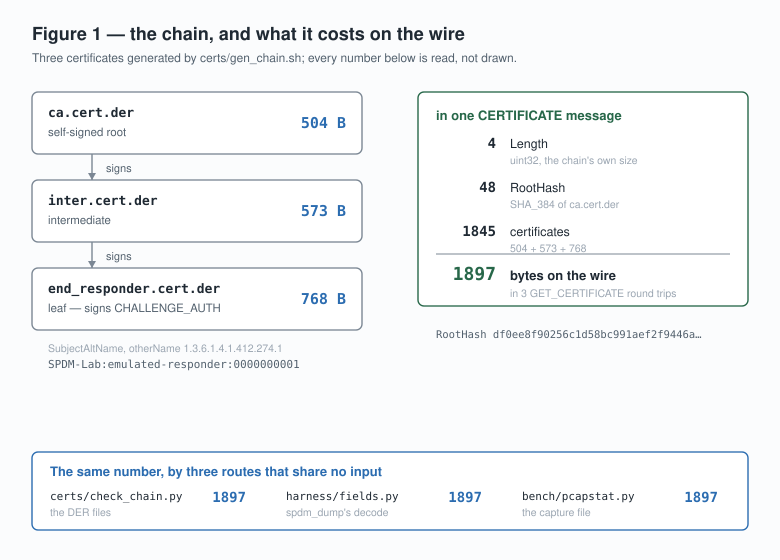

# What each week established

This file is the README as it stood at the end of week 11, below its first
screen, moved here **verbatim** on 2026-09-23 so that the README could be read
in five minutes. Nothing was edited except relative links, which were rebased
from the repository root to `docs/` by a script. `git log --follow` on either
file shows the move.

**It is a snapshot, not the present.** Its gate table says week 11, and a gate
it calls "in progress" or "not started" may have moved since. What is true now
is in the [README](../README.md), [`roadmap.md`](roadmap.md) and
[`RUNBOOK.md`](../RUNBOOK.md), and the day-by-day record, including every
mistake, is [`LOG.md`](../LOG.md).

---

## Verifying this repository in five minutes, without building anything

Everything below runs against **committed evidence**. None of it needs
`libspdm`, a build tree, a network or more than `python3`, `gcc` and `make`.
That constraint is deliberate: a claim that can only be checked by the person
who made it is not a claim a reader can use.

```bash
git clone https://github.com/Jhongwe1/mctp-spdm-pqc && cd mctp-spdm-pqc

bash harness/verify_repo.sh        # ~90 s, and it is the whole argument
```

| what it re-derives, and what would turn it red | where |
|---|---|
| every published cross-capture number, **re-computed from the captures it names, at a tolerance of zero** — change one byte of one `.pcap` and it fails | `harness/check_claims.py` |
| every number a document *quotes*, against the capture named beside it | `harness/fields.py --check` |
| a **tampered measurement is still judged FAIL**, and the exit code reaches the shell in both directions | `rats/appraise.py` |
| the version rule was loosened in **one direction only** — four cases under the live policy and a frozen copy of the one it replaced, and exactly one verdict may have moved | `rats/test_svn_policy.sh` |
| 24 negative-test cases against **21 deliberately wrong implementations**, each of which must be caught by exactly the cases its own file declared in advance | `negative/` |
| six verdicts about whether this project's own builds carry three 2026 advisories — and a self-test proving the tool can still answer something other than "not affected" | `harness/check_advisories.py` |
| every committed figure still renders, byte-identically, from the data it claims to show | `harness/mkfigures.py --check` |
| every artifact still hashes to what its `manifest.json` attests to — 1,939 of them | `harness/verify_repo.sh` |

★ **Most of those checks exist in pairs**: one that runs the mechanism, and one
that feeds it something wrong and requires it to fail. A check that has never
been observed failing is arithmetic that happens to agree — standing rule 11,
and it is the rule the rest of this repository is built on.

The one thing it deliberately does **not** do is rebuild upstream. That is the
weekly job, and [`RUNBOOK.md`](../RUNBOOK.md) §12 is the forty-minute version for
anyone who wants it.

---

## Current status

This is week 11 of a 14-week programme. The table below is the truth about what
exists today, not what is planned. Planned work is in
[`docs/roadmap.md`](roadmap.md), which carries the same table.

| Gate | Subject | State |
|:--|---|---|
| G0 | environment and version baseline | **complete** — see [`docs/env-baseline.md`](env-baseline.md) |
| G1 | full handshake, field by field | **complete** — seven message pairs annotated against a capture, 164 values asserted by CI, four pairs whose offsets are reconstructed from the wire. What is still transcribed, and the three questions still open, are named in [§10](handshake-walkthrough.md) |
| G2 | certificate chain, three tamper points | **complete** — **Table 1**, five rows over ten controlled arms, every point measured ([`docs/tamper.md`](tamper.md)). Point 2 needed a proxy and became two arms, which is where the pair that fails identically for opposite reasons turned out to live |
| G3 | RATS verification pipeline | **complete** — reference values, a COSE-signed endorsement, a policy and a verdict, over all ten tamper arms ([`docs/rats-pipeline.md`](rats-pipeline.md)). **Table 3.** The one tamper nothing in SPDM refused is judged FAIL, and the `rats` job turns red if it stops being. The version rule is now `evidence >= reference`, and the four cases that prove the change moved **exactly one** verdict — and did not loosen the integrity rule — run in CI |
| G4 | post-quantum cost quantification | **complete** — **Table 2** and **Figures 2 and 3**: six algorithm groups over three matched comparisons, a DataTransferSize sweep on a build made to have one, and every signature length in the table re-derived from a message-size difference and landing on its FIPS constant exactly ([`docs/pqc-cost.md`](pqc-cost.md)). The negotiation costs 152 bytes in all six groups; the certificate chain is 86% of the post-quantum arm; and DataTransferSize turns out to be a latency parameter, not a bandwidth one — 3.1% of bytes against 59 round trips over a 32x range |
| G5 | real transports (QEMU / AF_MCTP) | **complete** — **Table 4**: both arms of the post-quantum comparison run across a real Linux MCTP link, in a guest whose kernel has the subsystem this host lacks, and every packet is counted off the wire instead of divided. The model reproduces all 953 of them, at seven message lengths where the plausible wrong formula would have said something else. Separately, one SPDM `GET_VERSION` crosses a real PCIe DOE mailbox on a QEMU NVMe device and comes back answered ([`docs/transports.md`](transports.md)) |
| G6 | conformance and negative testing | **complete** — DMTF's own `SPDM-Responder-Validator` run **four ways** against this responder, with a root cause and a classification for each of its eight failures, and — because a suite observed only passing has not been shown able to fail — a fourth arm that changes **one byte of one signature in flight** and requires exactly the assertion that reads it to move, and nothing else ([`docs/validator-report.md`](validator-report.md)). Two upstream findings came out of it, the second **proved rather than argued**: the four `response signature` failures are the suite's own test case discarding the certificate chain it needs, and the responder's signatures verify against the leaf key. Clearing **one** capability bit moved **611** assertions from never-executed to executed. Fuzzing and coverage are beside it ([`docs/negative-tests.md`](negative-tests.md)) — 69.7% line coverage, 11,432 executions, no crashes, and a corpus comparison that **withdrew the claim it was written to support**. And [`negative/`](../negative/) now holds the three advisory classes as tests: **24 cases and 21 deliberately wrong implementations**, each of which must be caught by exactly the cases its own file predicted — no fewer and no others — plus two runs that assert what AddressSanitizer does and does not see. Separately, whether *this project's* builds carry the three defects is measured rather than argued ([`docs/advisories.md`](advisories.md)): **one of the two flavors is affected**, on five independent preconditions |
| G7 | upstream contribution | **in progress — both changes sent, awaiting review.** The gate asks for a change submitted *with reviewer correspondence*, and the correspondence is the half nobody controls. Two changes, two projects, two different processes, both submitted on 2026-09-22. ① [`DMTF/spdm-emu` #524](https://github.com/DMTF/spdm-emu/pull/524): `CoRimTool.py verify` does not verify, in two lines that mask each other — fixing only the obvious one turns a verifier that accepts nothing into one that accepts anything, which was **measured** rather than reasoned about. DCO check green; reviewers assigned by CODEOWNERS. ② [`openbmc/spdm` 94773](https://gerrit.openbmc.org/c/openbmc/spdm/+/94773): a first `README.md`, written against the 2025 review that killed the last attempt. ★ **A freshness check ran immediately before each push, and changed what was sent both times:** `spdm-emu`'s `main` had moved again, so the branch was rebased a second time and the `patch-id`, the blob and the 392 CRLF line endings were all shown to survive it; and `openbmc/spdm`'s two required linters had disappeared from the machine since the change was prepared, so they were reinstalled at their pinned versions and re-run before the `Tested:` line could be repeated. **Nineteen** candidates carry evidence; two are sent, and the rest are recorded with their reproductions rather than bundled. ★★ **The first review arrived 35 minutes after the push, and it found the one thing four days of preparation had got wrong:** this project had concluded OpenBMC has no AI-assistant policy, on the evidence of a `grep` over `CONTRIBUTING.md`; a reviewer produced one from a change still in flight (`openbmc/docs` 89452, 404 on `master`). Both comments were answered the same day, every factual claim in the replies checked mechanically first — and one of those checks was itself wrong. Neither change is merged and both threads are open, which is why this gate is not complete |
| G8 | delivery and write-up | not started |

Nothing in this repository reports a measurement that has not been made. A
table that does not exist yet is absent rather than sketched.

### What week 11 established

**Gate 6's lower half, and an identifier that does not resolve.**

`plan/W11` named four advisory identifiers. Week 10 refused to write any of
them into a source file, because standing rule 7 — *nothing is cited that has
not been checked against the primary source* — applies to a security advisory
more than to anything else. Week 11 checked them.

**All four are correct.** And checking them produced three facts that would
have been wrong if they had been assumed:

| | |
|---|---|
| **none of the three is in GitHub's global advisory database** | they are *repository* advisories on `DMTF/libspdm`, so `https://github.com/advisories/GHSA-m4wc-xmvg-369f` — the URL a reader tries first — returns **404** for every one of them |
| **two of the three have no CVE**, and they are the two with the *higher* score | 6.9 and 6.9 against 6.0. DMTF-2026-0001 says why in its own words: *"due to the unlikely chance of implementation in a production device, no CVE has been issued"* — a CVE is a judgement about deployment, not a threshold on a number |
| **the one CVE was in neither place a CVE lives** | `CVE-2026-61810` returned 404 from MITRE's CVE Services and `totalResults: 0` from NVD |

★ **And `DSP0274 1.4.1` turned out to be downloadable**, which the plan had
warned it might not be. So the third advisory — a defect in a *specification*,
not a library — could be read in both versions instead of taken on trust. The
phrase `[FINISH].SPDM Header Fields` occurs **five times in 1.4.0 and zero
times in 1.4.1**, which is the count the advisory gives for affected
definitions, arrived at from the documents. All five now read *"`*` except the
Signature and RequesterVerifyData fields"*.

> ★★ **The fix is not a field. It is a change of shape.** 1.4.0 enumerated what
> the transcript *includes*; 1.4.1 names what it *excludes*. And the
> enumeration was not wrong when it was written — in SPDM 1.3 a `FINISH` was a
> four-byte header followed by its authenticator, so "the SPDM Header Fields"
> really was everything a signature had to cover. **It became wrong when
> somebody edited a different chapter.** ([`docs/transcript.md`](transcript.md))

**The three classes are now tests, and the tests have to be able to fail.**
`negative/` holds 24 cases and **21 deliberately wrong implementations**. Each
defect declares in advance exactly which cases it must move and which of those
it must move all the way to accepting the input; `make test` builds every one
and fails if a case moves that nobody predicted — rule 13, mechanised — as
loudly as if none moves at all. It corrected its author on the day it was
written.

Three things came out of writing them that reading about them would not have:

- **The same wrong expression is not equally wrong at every field width.**
  `off + len` wraps for `uint32_t` operands and does not for `uint16_t`, which
  are promoted to `int` first. At 32 bits the naive check **accepts** an
  out-of-range window; at 16 bits it refuses for the wrong reason. The advisory
  is against the 32-bit message. Two defects differ *only* in that, and the
  suite asserts the difference rather than describing it.
- **AddressSanitizer reports an overflow out of a bare array and says nothing
  about the same overflow into the next member of the same struct** — asserted
  by a script that runs both, so a toolchain upgrade turns the build red rather
  than quietly invalidating a paragraph. A layer above it, GCC rejects the first
  at *compile* time through `_FORTIFY_SOURCE` and not the second, and only when
  the length is a constant. A firmware length never is.
- **Reading the published fix found a failure mode the week-10 status codes
  could not report.** DMTF-2026-0001's defective code *did* check the remaining
  space — after the copy. **The refusal it returned was the right refusal**, so
  a suite comparing status codes would have seen nothing.

★ And DMTF-2026-0002's entire fix is **one character of parenthesis**:
`(uint64_t)(offset + length)` became `((uint64_t)offset + length)`. The widening
cast was already there; it was applied to a sum that had already wrapped.

**Is this project affected?** Measured, not argued, five ways per advisory
([`docs/advisories.md`](advisories.md) §3). The `pqc` flavor carries both
fixes. The `stable` flavor — libspdm 3.8.0 — is **AFFECTED** by DMTF-2026-0002,
and every precondition the advisory names holds, including the one that is not
about the code: `libspdm_copy_mem()` *does* check `src_len > dst_len`, the check
is spelled `LIBSPDM_ASSERT`, and `TARGET=Release` defines
`LIBSPDM_DEBUG_ENABLE=0`, which makes that macro expand to nothing while the
copy loop below it runs regardless. No capture in this repository has ever sent
the request that reaches it, and that is re-derived from the decodes rather than
asserted.

### What week 10 established

**Gate 6's upper half, and the week the instrument was wrong.**

DMTF publishes a conformance suite — `SPDM-Responder-Validator`, written to
DSP-IS0023 — and `spdm-emu` has been building it into this project's tree since
week one. Running it is one command. **Running it four times is the week.**

A suite that has only ever been observed passing has not been shown able to
fail, so three of the four arms exist to make it say something else:

| | |
|---|---|
| **one capability bit** | clearing `MUT_AUTH_CAP` from the responder's advertised set moved **611 assertions** from never-executed to executed, and turned four entire test groups from `pass: 0, fail: 0` into results. That "only one bit moved" is read back off both captures and required to hold **in every negotiated version** — and it is not free: two assertions elsewhere went the other way. There is no configuration that maximises the report |
| **one signature byte** | the suite reached the responder through week five's tamper proxy twice: once changing nothing, which had to reproduce the baseline exactly, and once flipping the last byte of one `MEASUREMENTS` signature. **Exactly one assertion moved, and it is the one named `response signature`.** Nothing improved, and every assertion that vanished is inside that same case |

★ **And then the strongest result this project has produced.** The suite reports
four `CHALLENGE_AUTH` signature failures. The cases that fail are exactly the
ones whose message mask omits `GET_CERTIFICATE`; the one that omits the
*digests* and keeps the certificate passes. Reading the source says why — each
case calls `libspdm_init_connection()`, which sends `GET_VERSION`, which calls
`libspdm_reset_context()`, which frees the certificate chain the case's own
setup fetched.

**That is a story, and this repository does not publish stories.**
`harness/challenge_verify.py` rebuilds the transcript from the capture and hands
the arithmetic to OpenSSL — and calibrates before it answers, verifying the nine
connections the suite *passes* before reporting on the two it fails:

```
calibration   9 of 9 verify
disputed      2 of 2 verify
```

**The responder's signatures are valid. The conformance suite reports a
conforming device as non-conforming**, because its own test case discarded the
input it needed. That is upstream candidate ⑲ and it ships with its proof.

**The fuzzing half withdrew a claim instead of making one.** The sentence this
week was meant to produce — *"my seeds are real messages, not random bytes"* —
compares against an opponent nobody fields. libspdm ships a corpus: 69
directories, 81 files, mostly one hand-written seed per target. Measured with
`afl-showmap` rather than asserted, this project's 312 deduplicated seeds reach
**fewer** edges than upstream's on three of thirteen comparable targets, and the
first run of the comparison — drawn from two successful handshakes — lost
outright and added **zero** edges on `algorithms`. It is committed with its
losing numbers.

> ★ **A seed is not good because it is real. It is good because the run it came
> from went somewhere.** Two successful handshakes contain one well-formed
> message per type and no error paths, because a handshake that took one would
> not have completed. Adding a capture of the conformance run — which sends
> malformed requests deliberately — reversed every column.

Eleven thousand four hundred and thirty-two executions, no crashes, and the
arithmetic that makes that a result rather than a shrug: **9.07 executions per
second**, so even the eight-hour campaign the plan asked for is three orders of
magnitude short of where an absence of crashes would mean anything. 69.7% line
coverage, 76.5% of the responder handlers, and two unit tests that do not pass
because one **refuses to run without `LIBSPDM_FIPS_MODE`** and the other cannot
find a fixture — neither of which is a failing assertion, which is now standing
rule 20.

### What week 9 established

**Gate 5 is closed, and the sentence it existed to delete is deleted.**
`docs/fragmentation.md` opened §5 with *"No packet count here has been
observed."* Every MCTP packet count this project had published was arithmetic
on a measured message length, honestly labelled `[computed]`, because the
development host has no `CONFIG_MCTP` and `socket(AF_MCTP, SOCK_DGRAM, 0)`
returns `EAFNOSUPPORT`.

★ **That was never a reason to stop, and treating it as one for eight weeks was
the mistake.** The subsystem did not have to be on the host; it had to be
somewhere the same binaries could run. A guest kernel built with
`CONFIG_MCTP=y`, whose root filesystem is the host's own over virtio-9p, runs
the `spdm_requester_emu` from week one unchanged, from the same path, against
the same certificates. The host kernel is untouched, which matters because
`host_kernel` is recorded in all twenty-five earlier run directories
([ADR 0010](decisions/0010-a-kernel-the-host-does-not-have.md)).

**Both arms of the post-quantum comparison then crossed a real MCTP link** —
real endpoint IDs, a real route table, kernel-allocated tags, and packetisation
at DSP0236's baseline 64-byte transmission unit. **Table 4:**

| | A0 classical | P2 post-quantum | ratio |
| --- | ---: | ---: | ---: |
| SPDM messages | 22 | 46 | 2.09x |
| SPDM bytes | 6,449 | 58,736 | 9.11x |
| **MCTP packets, observed** | **115** | **953** | **8.29x** |
| framing as a share of the wire | 7.0% | 6.2% | |

★ **The packet ratio is smaller than the byte ratio, and that is the transport
result.** A transmission unit is charged whole, so the classical arm's many
short messages waste more of each packet than the post-quantum arm's few long
ones. On a bus where the per-packet cost dominates — SMBus at 100 kHz — the
ratio a reader should quote is 8.29 and not 9.11, and no capture taken over a
TCP socket can say which.

**The control is what makes that legitimate.** Each arm was recorded twice, by
two programs sharing no code: the emulator's own message-level pcap and an
`AF_PACKET` capture of the link. The message-level captures match week eight's
socket-line ones *exactly* — same record count, same bytes, same per-message
length sequence — so **the transport changed nothing about the protocol**, and
the two layers reconcile through the five bytes of framing known to sit between
them, asserted on every run rather than left to a reader.

★ **And a claim this project had been publishing for three weeks turned out to
be arithmetically false.** `docs/fragmentation.md` said 177 bytes was the case
separating the right packet formula from the plausible wrong one, because the
wrong one "says 4". `59 x 3 = 177` exactly, so it says 3, and 177 is one of the
300 lengths in 1..399 where the two *agree*. Nothing caught it because the rival
formula was named in a sentence and never evaluated — the self-test only ever
checked that the right formula gave the right answer, which it would have done
at a length that proved nothing. The rival is now a function, the separation is
computed, and the calibration run reports how many of its messages actually
discriminate: **seven of twelve, and the wrong formula is wrong at every one.**

**The second half of Gate 5 is a real PCIe DOE mailbox.** A QEMU-emulated NVMe
controller with `spdm_port` set gives the guest a Data Object Exchange
capability that `lspci -vvv` enumerates out of config space. Linux 6.12 has no
in-kernel CMA-SPDM requester, so `transport/doe_probe` drives the mailbox from
userspace — DWORD writes, `GO`, a poll of `DATA OBJECT READY`, a read mailbox
that must be popped — enumerates all three DOE protocols, and sends one
`GET_VERSION`. It comes back `VERSION` advertising 1.0 through 1.4, through
config space rather than through a socket.

Three faults had to be turned into checks before any of this was believable, and
all three produced a *plausible number* rather than an error.

- **A capture that began two thirds of the way through.** A `sleep 0.7` was
  standing in for a synchronisation, and the interpreter's own start-up crosses
  9p. The first record of the capture had `SOM` clear. The capture now creates a
  readiness file and the traffic generator blocks on it.
- **An `AF_PACKET` socket that dropped 33 packets under a burst.** The same run
  repeated gave 920 packets where the first gave 953, and the first visible
  symptom was 86 orphaned continuations — a diagnosis of the *link*, for a fault
  in the *instrument*. The socket's own `PACKET_STATISTICS` drop counter is now
  read, and a non-zero value fails the capture.
- **An MCTP interface that appeared in the wrong network namespace.**
  `mctp_serial_open()` calls `alloc_netdev()` and `register_netdev()` with no
  `dev_net_set()` between them, so the netdev lands in `init_net` whichever
  namespace attaches the line discipline. No command failed and no interface
  existed.

Standing rule 13 applies to the first two: they are caught by *different*
checks, because comparing the capture against the interface counters cannot see
a late start, and the reassembly check cannot see a uniform loss.

**Upstream, the second change is prepared.** `openbmc/spdm` still has no README
— but one was attempted in May 2025 by one of the repository's own reviewers,
rejected by the maintainer for *"hypotheticals that do not match the code"*,
failed CI twice, and was auto-abandoned a year later for inactivity. That review
is the specification: describe only what the merged tree does, cite the Redfish
design document one reviewer asked for, add the code-organization section
another asked for, and pass the markdown linters that turned it red. It is also
where a second finding came from: the tree **does** build with GCC 14.2 though
not with the distribution's 13.3, and `meson test` then fails one suite of three
on any machine that is not a BMC, because `test_policy_manager` asks D-Bus for a
well-known name it is not allowed to own. All three pass on a bus that permits
it, and the README says so in one line.

### What week 8 established

**Four things were measured that the week's plan did not ask for, and one thing
the plan asked for turned out to be false.**

Gate 4 wanted six algorithm groups instead of two. It got them, arranged so that
each is the other half of one question — classical against post-quantum at NIST
category 3 *and* at category 5, and lattice against hash-based signatures with
the KEM held fixed. **The gap widens with the level: 8.99× at category 3 and
10.91× at category 5.** One A/B could not have said that.

**The negotiation is free, and it is free to the byte.** Six extra arms did
nothing but Version-Capabilities-Algorithms, and all six captures are 182 bytes —
the same whether the thing being agreed is ECDSA P-384 or SLH-DSA-SHA2-128s. Not
the same *bytes*: the algorithm fields carry different bits in fields of the same
width, which is the point stated exactly.
`ALGORITHMS` selects a *bit*. So none of the cost in Table 2 is paid to agree on
an algorithm; all of it is paid afterwards, and 86% of it is the certificate
chain. Then the same 152-byte subtotal was found inside every full capture, which
makes two routes to one number and neither needed the other.

**Every signature length in the table falls out of a message-size difference, and
every one matches its published constant exactly.** `CHALLENGE_AUTH` is 142 bytes
of content fixed by the negotiated hash plus one signature. Subtract the 142 and
the six arms give 96, 132, 2,420, 3,309, 4,627 and 7,856 — ECDSA P-384 and P-521,
ML-DSA 44/65/87, SLH-DSA-SHA2-128s. **None of those numbers is an input anywhere
in the pipeline.** Six residuals landing on six FIPS constants is what says the
measurement is calibrated, and it is also what proves the 142 is constant across
the arms rather than assumed to be.

★ **`DataTransferSize` is a latency parameter that looks like a bandwidth one.**
It has no upstream flag — it is a compile-time constant minus transport overhead
— so a third build flavour was made with a 55-line patch that lets it move at
run time, and it was swept over a 32× range. **The byte total moves 3.1%. The
round trips move from 59 to zero.** Each round trip is a bus RTT, which on SMBus
at 100 kHz is the expensive half of the cost. Week 7 had published that a large
`DataTransferSize` would remove chunking "while the byte total barely moves" —
reasoned, not run. It is now run, and the sweep carries its own control: the
patched build told to use the unpatched value reproduces its capture byte for
byte, which is the only thing that makes a second build comparable to a first.

**And turning chunking off made it cheaper.** The plan expected `CHUNK_CAP` to be
absent from the emulator's defaults and to need adding. It is present on both
sides. Removing it from the responder did not break the post-quantum handshake:
libspdm windowed `GET_CERTIFICATE` to `DataTransferSize` instead, and the
handshake got **three round trips shorter and nine bytes smaller**. The three
`ERROR(LargeResponse)` exchanges chunking needs first are pure overhead at this
chain size.

Two things had to be fixed before any of that could be believed.

**The analyser could not see the thing being measured.** A chain larger than
`DataTransferSize` never appears in a `CERTIFICATE` message at all, so
`pcapstat.py` reported zero chains for every post-quantum arm while the whole
chain sat in the capture — and the only tool that could reach it was the
reference decoder, whose decode of that capture is truncated at 22.8%. It now
reassembles `CHUNK_RESPONSE` sequences out of the capture's own bytes, and three
independent routes agree on 16,853. It is also shown *refusing*: a gap in
`ChunkSeqNo`, a lying `ChunkSize`, a `LargeMessageSize` that disagrees with its
chunks, and a sequence with no `LastChunk` are four of fourteen self-tests.
`CHUNK_SEND` has no capture to test against here, so it is named as unhandled
rather than written blind.

★ **And no manifest had ever recorded the crypto library.** libspdm statically
links its own **OpenSSL 3.5.5** from a submodule; the *system* `openssl` is
3.0.13, and that is the one every `manifest.json` recorded. ML-DSA, ML-KEM and
SLH-DSA arrived in OpenSSL 3.5 — so a reader who took the recorded version for
the backend would have concluded these captures are impossible. Every pin and
every future manifest now names the vendored commit and version, backfilled
without recompiling the binaries behind the published captures. The same audit
found that the device patch applied on 2026-09-01 appeared in no manifest either.

**SLH-DSA does not complete a handshake on this build, and where it stops is the
finding.** Bisecting on `--exe_conn` with ML-DSA-44 as the control: every
operation that does not require a signature succeeds, including parsing and
verifying a certificate chain whose every signature is SLH-DSA; both operations
that do require one fail. The `CHALLENGE_AUTH` arrives whole, at exactly
142 + 7,856 bytes, so the responder signed correctly. What is left is
verification, and the specific status is unrecoverable because a `Release` build
compiles libspdm's debug output out. The arm stays in Table 2 as a partial
handshake.

That closes Gate 4. Seventeen upstream candidates now carry evidence, four of
them from this week, and the newest is a patch rather than a complaint.

### ★ The independent variable, in full

The proof that these comparisons are single-variable is not the flag list in
`harness/run_pair.sh` — it is what is left when two arms' recorded command lines
are compared flag by flag. Printed at the end of every run, and here verbatim
from [`bench/data/w8-pqc-matrix-20260914T131557Z`](../bench/data/w8-pqc-matrix-20260914T131557Z):

```
A0-all vs P2-all   (classical vs post-quantum, matched NIST category 3)
  18 flags identical. The difference, in full:
    --asym           ECDSA_P384           -> NONE
    --dhe            SECP_384_R1          -> NONE
    --kem            NONE                 -> ML_KEM_768
    --pqc_asym       NONE                 -> ML_DSA_65
    --pqc_first      <absent>             -> TRUE

A1-all vs P3-all   (the same question, matched NIST category 5)
  18 flags identical. The difference, in full:
    --asym           ECDSA_P521           -> NONE
    --dhe            SECP_521_R1          -> NONE
    --kem            NONE                 -> ML_KEM_1024
    --pqc_asym       NONE                 -> ML_DSA_87
    --pqc_first      <absent>             -> TRUE

P1-all vs S1-all   (lattice vs hash-based signatures, KEM held fixed)
  22 flags identical. The difference, in full:
    --pqc_asym       ML_DSA_44            -> SLH_DSA_SHA2_128S
```

**The third one is the point.** Twenty-two flags identical and exactly one
different: the signature algorithm. Whatever the certificate chain does between
those two arms — 12,266 bytes against 24,782 — it does because the signature
family changed and for no other reason available.

The first two cannot be one line, because a classical arm and a post-quantum one
must turn each other's algorithm groups off; `NONE` in four places is what "off"
is spelled as. Those four moves are the comparison. Nothing else moved, and the
count is how you check that rather than taking the flag list on trust.

These are **command lines recorded before each run**, not reconstructed after
it, and each arm's copy sits in the run directory beside its capture.

### What week 7 established

**A judgement was changed, and the change was measured rather than described.**

Until this week the appraisal policy compared the secure version number for
**equality**, which is what DMTF's sample policy does. That rule is wrong in
two opposite directions at once: every device that takes a firmware update
fails, and a device that is rolled back to an older version is refused *with
the same check, the same category and the same index* as one that was upgraded.
Rows `svn5` and `svn9` in last week's Table 3 produced byte-identical output.

The rule is now per index and one-sided — `evidence >= reference`. Changing it
is worth nothing on its own, so the four cases are run under the new policy
**and** under a frozen copy of the one it replaced, on the same four captures,
against the same signed reference value. Eight cells, and exactly one may move:

| case | device SVN | `==` (frozen) | `>=` (live) | |
|:--|--:|---|---|:--|
| S-eq · `t0_clean` | 7 | PASS | PASS | |
| **S-up** · `svn9` | 9 | **FAIL** `svn_mismatch[16]` | **PASS** | ★ |
| S-down · `svn5` | 5 | FAIL `svn_mismatch[16]` | FAIL **`svn_rollback[16]`** | |
| S-hash · `t1_meas` | 7 | FAIL `digest_mismatch[1]` | FAIL `digest_mismatch[1]` | |

**S-hash is the row the table would be dishonest without.** Relaxing a rule
invites exactly one question — *did you relax security?* — and the answer has
to be a cell rather than an assurance. Its version number is correct and one
byte of measurement index 1 is not; both columns refuse it, and neither
column's version check fires at all.

`bash rats/test_svn_policy.sh` produces the table, `harness/verify_repo.sh` and
CI both run it, and `rats/rats_selftest.py` asserts that the two policies
differ in code only inside one marked region — so a verdict that moved cannot
have been moved by anything else. What the loosening **cost** is beside the
result in [`docs/rats-pipeline.md`](rats-pipeline.md) §5: `>=` stops a
rollback *below the reference value* and nothing else, so a device on version 9
pushed back to 7 satisfies it exactly and this policy says PASS.

That closes Gate 3.

---

**Table 2, first half** — post-quantum cost, two algorithm groups of six, at
matched NIST level 3. Full method, and everything it does not measure, in
[`docs/pqc-cost.md`](pqc-cost.md).

| quantity | A0 · ECDSA-P384 | P2 · ML-DSA-65 | ratio |
|---|--:|--:|--:|
| responder certificate chain | 1,655 B | 16,853 B | **10.18×** |
| handshake bytes, `--meas_op ALL` | 6,559 B | 58,966 B | **8.99×** |
| handshake bytes, `--meas_op ONE_BY_ONE` | 15,587 B | 93,698 B | **6.01×** |
| one signature (`CHALLENGE_AUTH`) | 238 B | 3,451 B | **+3,213 B** |
| `GET_CERTIFICATE` round trips | 3 | 3 | 1.00× |
| `CHUNK_RESPONSE` messages | 0 | 12 | — |

**Two rows of that table are the same experiment.** Measured over the flow that
asks for every measurement in one message, post-quantum authentication costs
8.99×; measured over the emulator's default flow, which walks every measurement
index, it costs 6.01×. The walk adds ~9,000 bytes that are identical in both
arms, and a constant added to both sides pulls a ratio toward 1. **A cost ratio
is a property of a workload, not of an algorithm**, and either number without
the flow beside it is unreproducible.

The difference between the two flows is not a constant either, and that is the
part the totals could not say. `ONE_BY_ONE` makes the responder sign **nine
times instead of once**: of its seventeen `MEASUREMENTS` responses, eight are
byte-identical across the two arms and nine differ by exactly 3,213 bytes each
— one ML-DSA-65 signature minus one ECDSA P-384 signature, counted rather than
inferred.

**The certificate chain never appears in a `CERTIFICATE` message.** At 16,853
bytes against a negotiated `DataTransferSize` of 4,608, the responder answers
`GET_CERTIFICATE` with `ERROR(LargeResponse)` and the chain arrives through
SPDM's chunking layer. `GET_CERTIFICATE` round trips are 3 in both arms; what
moved is `CHUNK_RESPONSE`, 0 against 12. A table reporting only the first
number would have said the post-quantum chain was free.

**Single-variable is a thing that is proved here, not intended.** Eighteen
flags are pinned, read out of `spdm_emu_common/key.c` rather than out of
`--help`, and every message that is not the experiment is byte-identical across
the arms — `NEGOTIATE_ALGORITHMS` 48, `ALGORITHMS` 52, `DIGESTS` 300. Left at
their defaults, both arms would have carried a requester RSA-3072 certificate
chain nobody asked for, which in an earlier capture is 22% of the bytes. And
because *requesting* an algorithm and *negotiating* one are different events,
every arm declares what it expects to be negotiated in all twelve groups and
`harness/run_pair.sh` **refuses the run** when the wire disagrees.

That check refused its first ever run, correctly: the flag combination this
project's own plan specified for switching mutual authentication off makes the
handshake impossible on this build, and the only diagnostic is a libspdm status
code that names no flag. It is now upstream candidate thirteen —
[`docs/upstream/README.md`](upstream/README.md).

**Every ratio above is re-derived from the captures it names** by
`harness/check_claims.py`, which is new this week and exists because
`harness/fields.py --check` binds a claim to *one* capture and a ratio belongs
to neither of its two. Every tolerance in `bench/claims.json` is **0.0**: these
are byte counts out of committed files, and a non-zero tolerance on a
deterministic quantity is a check that has been asked not to fail.

### What week 6 established

**The row where nothing happened now fails.** Week 5 ended with a measurement
changed on the device, a handshake that completed, every signature verifying,
and no status code anywhere. That is the boundary of what SPDM claims, and it
is the thing a reference value is for.

**Table 3** — the same ten arms, appraised against a COSE-signed reference value
under a policy. The left column is what the *handshake* did; the right is what
the *appraisal* says about the same captures:

| arm | what changed | SPDM handshake | appraisal |
|:--|---|---|:--|
| `t0_clean` `t0_none` `t0_proxy` | nothing | completed | **PASS** |
| **`t1_meas`** | a measurement, **on the device** | **completed, no status** | **FAIL** — `SPDM_HASH_CHECK`, index 1 |
| `t2a_record` | the record, in flight | refused `80020001` | **FAIL** — `SPDM_HASH_CHECK`, index 1 |
| **`t2b_sig`** | the **signature**, in flight | refused `80020001` | **PASS** |
| `t3_cert` | a certificate | never sent, `8001000a` | *no evidence* |
| `t3b_foreign` | *whose* certificate | completed | **PASS** |
| `svn5` `svn9` | the secure version number | completed | **FAIL** — `SPDM_SVN_CHECK`, index 16 |

**Rows `t2a` and `t2b` answer the question week 5 left open.** Both print the
same status. With the appraisal beside it, two one-bit answers give three
distinguishable states: *refused and FAIL* is content that is wrong and unsigned
for; *refused and PASS* is a measurement that is fine and a conveyance that
broke; *completed and FAIL* is a healthy link and a wrong device. What that
costs in a real deployment — the requester discards a message it rejects — is in
[`docs/rats-pipeline.md`](rats-pipeline.md) beside the table, not in a
closing section.

**`t3b_foreign` passes and that is correct**, because the measurements really
are the reference values. What is wrong is whose device it is, which is an
identity question this policy does not answer and says so.

**Six of eight measurement blocks can be appraised at all.** `MEASUREMENT_MANIFEST`
and `DEVICE_MODE` are raw bit streams with no encoding in DMTF's evidence
format, so no policy can read them — including the bits that say whether the
device is in a debug mode. Every verdict carries the coverage number, because
*this device passed* and *this device passed the part of itself anything can
look at* are different sentences.

**The `rats` CI job exists**, and it is the one the roadmap has carried as a
promise since week one: reference values → policy → verdict, with
[`rats/out/expected.json`](../rats/out/expected.json) stating per arm what the
outcome must be and why. Not a snapshot — a policy that passed everything would
reproduce a snapshot perfectly.

**The published tooling this was built on does not work.** Running DMTF's own
example verbatim, before connecting anything, produced seven findings; the
sharpest is that `CoRimTool.py verify` has never verified a signature, in two
lines that mask each other. A one-line fix for the obvious one was committed and
one keystroke from being sent — and it would have turned a verifier that accepts
nothing into one that accepts anything. It was caught by a script written to
re-run the commit message's own `Tested:` claims.
[`docs/upstream/`](upstream/README.md).

### What week 5 established

**Table 1 is finished, and its most important row is the one where nothing
happened.** Five tampers, ten controlled arms, one control taken before the
code under test existed:

| # | what changed | where | what happened | status |
|:--|---|---|---|---|
| **1** | the measurement value | on the **device** | **handshake completed** | **none** |
| **2a** | the measurement record | **in flight** | refused | `80020001` `VERIF_FAIL` |
| **2b** | the **signature** | **in flight** | refused | `80020001` `VERIF_FAIL` |
| **3** | a certificate | on the **device's disk** | never sent at all | `8001000a` `ERROR_PEER` |
| 3b | *whose* certificate | on the device's disk | **handshake completed** | none — a **warning** |

Rows 2a and 2b are the pair this project's own plan expected to find between
rows 1 and 2. It is not there: **a measurement changed at the device is signed
by the device**, so the requester receives a self-consistent pair and every
check passes. The pair that actually demonstrates "same message, opposite
cause" is inside point 2 — the signed *content* changed against the *signature*
changed — and it is stronger, because both halves reach a verifier and the only
difference between them is which side of the signature the byte was on.

> Both print `80020001`. **An integrator triaging from a log line cannot tell a
> corrupted device from a corrupted link**, and the two have completely
> different responses: one is a supply chain, the other is a cable. SPDM says
> *that* something is wrong, not *which layer* is.

The wire separates them immediately: `t2a_record` carries a measurement record
that differs from the control, `t2b_sig` carries the control's byte for byte.
The error message carries neither fact.

**[`harness/tamper_proxy.py`](../harness/tamper_proxy.py) is what rows 2a and 2b
needed, and what it refuses to do is the interesting part.** It sits between the
two emulators, and before changing a byte it closes two equations:

```
BaseAsymSel, read out of the ALGORITHMS response as it passes  ->  96 bytes
674 - (4 + 1 + 3 + 528 + 32 + 2 + 8)                           =   96 bytes
                                                                   ^ closed
```

**That equation refused this project's own plan.** `plan/W05.md` lists the
`MEASUREMENTS` fields without `RequesterContext` — eight bytes, present since
SPDM 1.3 — which would have put the signature eight bytes early. The proxy
declined to flip anything and printed both numbers.
`tamper_proxy.py --self-test` reproduces that refusal along with twelve others
and fails if any of its thirteen registered checks was never exercised.

**CI now turns red if tampering stops being detected.** `verify_repo.sh`
re-derives rows 1, 2a and 2b from the requester's own logs and the committed
`fields.json`, and fails if either in-flight tamper stops being refused, if the
two stop sharing one status, or if the device-side one *starts* being refused.
That last clause is deliberate: row 1 passing is a measurement, not a gap.

It also requires the proxy and the capture — two witnesses that never see each
other — to agree that the responder sent the control's record and that what the
proxy wrote is what the capture holds.

**A third route to the certificate chain's size.**
[`bench/pcapstat.py`](../bench/pcapstat.py) now reassembles the chain from each
`CERTIFICATE` response's `PortionLength` and reports `cert_roundtrips`. So
`4 + 48 + 1845 = 1897` is reached by three tools sharing no input: the DER files
on disk, `spdm_dump`'s decode, and the capture file. It found something the
other two could not — the `4.0.0-rc` responder sends the chain in **one**
message where the `3.8.0` responder sends it in two, six round trips against
three — and it found its own bug first: the 1.4 `LargeCertChain` layout moves
`PortionLength` to a 32-bit field at offset 8 and leaves the 16-bit one reading
zero, so a parser that trusts offset 4 reports an empty chain rather than an
error.

**No byte count in Table 1 detects anything.** A clean run, a proxied run and
three tampers are all 30 packets and 11,671 SPDM bytes, to the byte. A bit flip
does not change a size, and a size-based anomaly detector would see five
identical exchanges.

Full write-up, with every number re-derived from its capture on every CI run:
[`docs/tamper.md`](tamper.md). How an experiment gets run here at all:
[`docs/measurement.md`](measurement.md).

### What week 4 established

**A byte was changed in a device's own measurement, and SPDM did not notice.**
That is not a defect. It is the boundary of what the protocol claims, and it is
the reason Gate 3 exists. Week 5 turned it into row 1 of Table 1, beside four
tampers that *are* caught.

`libspdm`'s sample device secret library invents its measurements — index 1 is
the SHA-512 of 72 bytes of `0x01`, and the secure version number is the constant
`0x7` — so before anything could be tampered with, the values had to become an
input. [`device/`](../device/) does that in **sixteen added lines of upstream, three
of which are code**:

```c
    libspdm_set_mem(data, sizeof(data), (uint8_t)(measurements_index));
+   (void)ms_get_block(measurements_index, data, sizeof(data));

    svn = 0x7;
+   (void)ms_get_svn(&svn);
```

Both sit on the line *after* upstream computes its own value and leave the
buffer alone when they decline, so the diff is purely additive and hashing,
block assembly and signing are untouched. What a capture measures is still
libspdm's behaviour. A patched tree is one a pin no longer fully describes, so
the patch's digest goes into every manifest taken afterwards and a baseline is
taken with it reverted — the decision and its four rejected alternatives are in
[`docs/decisions/0006`](decisions/0006-patching-the-pinned-tree.md).

Then one byte of measurement index 1's pre-image was flipped:

| | `t0_clean` | `t1_meas` | `t3_cert` | `t3b_foreign` |
|---|--:|--:|--:|--:|
| `CERTIFICATE` messages | 3 | 3 | **0** | 3 |
| `CHALLENGE_AUTH` | 1 | 1 | **0** | 1 |
| measurement record | 528 B | 528 B | — | 528 B |
| blocks that changed | — | **1 of 8** | — | 0 |
| requester exit | 0 | **0** | 1 | **0** |

**`t1_meas` completed.** Every signature verified, because the responder signs
the record it actually sent — change what it reads and it signs the new value.
For a signature check to fail, the bytes signed and the bytes verified have to
differ, and changing the source is not one of the two ways to arrange that. The
certificate chain is different only because the requester holds an anchor it was
given out of band; there is no equivalent for a measurement.

> SPDM proves a measurement came from this device. It does not prove the
> measurement is correct. The second needs reference values, and reference
> values are not in the protocol.

**`t3_cert` failed earlier than expected, and for a different reason than
expected.** One byte inside the intermediate certificate's own ECDSA `s` value —
located by `certs/check_chain.py --locate`, so the certificate still parses and
exactly one link breaks. The obvious sentence is "the requester rejected the
chain". The capture refutes it: there is **no `CERTIFICATE` message at all**, and
`ProvisionedSlotMask` drops from `0x13` to `0x12`. The responder validates its
own chain when it loads it, could not, and stopped advertising the slot. A byte
flipped on the device's disk cannot reach the requester's verifier.

**So a case had to be added, and it is the one that did not fail.**
`t3b_foreign` serves a chain that is internally perfect and belongs to somebody
else — DMTF's own root, while the requester is configured to trust this
project's. The handshake **completed**. libspdm detects it and reports
`LIBSPDM_STATUS_VERIF_NO_AUTHORITY`, which is `SEVERITY_WARNING`; the sample
requester tests `LIBSPDM_STATUS_IS_ERROR` and a warning is not an error. That is
a deliberate hand-off to the integrator, and the transferable half is:

> An integrator who checks only `IS_ERROR` has accepted every certificate chain
> that parses.

The same acceptance is visible in a capture committed a week earlier: slot 4's
chain, root `ed79ce9a…`, is in neither of the two roots the requester was
provisioned with, and nothing minded.

**The secure version number now takes more than one value on the wire** — 5, 7
and 9, each changing exactly one of the eight measurement blocks. Gate 3's
rollback rule cannot be tested against a constant, and until this week it was
one.

Two new tools, and both exist to disagree with something.
[`bench/pcapstat.py`](../bench/pcapstat.py) walks the capture file itself and
totals bytes per message type; `fields.py` reaches the same totals from
`spdm_dump`'s output. Neither opens the other's input, and CI requires them to
agree across every committed capture — eighteen equations on the walkthrough
instead of one, and 55 captures at the time of writing. The one capture where they cannot agree measures something new: the
reference decoder sees **12.0%** of the post-quantum capture, 13,441 SPDM bytes
of 111,831.

Full write-up, with every number re-derived from its capture on every CI run:
[`docs/tamper.md`](tamper.md).

### What week 3 established



*Figure 1. Rendered by `harness/mkfigures.py` from `certs/check_chain.py`,
`harness/fields.py` and `bench/pcapstat.py`; CI re-renders it and fails if the
committed file no longer matches its data. Nothing on it is typed.*

**A certificate chain that predicted its own size on the wire, before it was
sent.** `certs/gen_chain.sh` builds a three-layer chain — root, intermediate,
leaf — and `certs/check_chain.py` computes what SPDM will carry from the files
on disk:

```
4 + 48 + (504 + 573 + 768)  =  1897 bytes
```

Then the handshake ran, and `harness/fields.py` read **1,897** out of the
capture, recovered **504 + 573 + 768** by walking DER, and confirmed that the
48-byte `RootHash` at offset 20 is `sha384` of the root certificate. Neither
tool was told the other's answer: `check_chain.py` never opens a capture,
`fields.py` never opens a certificate.

**`CERTIFICATE` is now over-determined by three equations, not one.** Week 2
rebuilt `CHALLENGE_AUTH` and `MEASUREMENTS` and required each to close on one
spare equation. This message has four, and no two share an input:

| | equation | checked against |
|---|---|---|
| closure | message length = 16 + `LargePortionLength` | the hex dump |
| agreement | chain `Length` = `PortionLength` + `RemainderLength` | three fields the responder wrote separately |
| structure | the certificates parse as DER `SEQUENCE`s consuming the chain exactly | nothing else |
| **digest** | `RootHash` = SHA-384 of the first certificate | computed, from bytes in the same message |

The fourth is the one worth having. Two lengths can agree because both came from
the same wrong assumption; a 48-byte digest cannot. CI breaks the reconstruction
four ways and requires four *different* checks to reject them.

**And the chain found something it was not built to find.** Replacing the
responder's chain replaced one of **three** trust anchors that a single
mutually-authenticating handshake carries:

| packet | direction | slot | bytes | root |
|--:|---|--:|--:|---|
| 10 | RSP→REQ | 0 | 1,897 | mine |
| 12 | RSP→REQ | 4 | 1,660 | upstream's `ecp384` root |
| 19 | REQ→RSP | 0 | 3,794 | upstream's `rsa3072` root |

SPDM negotiates the requester's signature algorithm separately, and libspdm's
sample library picks its certificate directory from the negotiated algorithm —
so a chain installed for `ECDSA_P384` never serves the direction that settled on
`RSAPSS_3072`. The handshake completes, every signature verifies, and nothing in
the flow says which anchor was used. On a reference design, the one still in
place is the reference implementation's, whose private keys are published.

`fields.py` now reports `layout.distinct_root_hashes` so that count is
something CI checks rather than something someone noticed once. The full
write-up is [`docs/certchain.md`](certchain.md).

**Two controlled arms, and both differences fully explained.** `sample-1slot`
and `selfsigned` differ in one thing — whose certificates the responder serves —
and `walkthrough` differs from `sample-1slot` in one flag:

| arm | packets | SPDM bytes | against the arm above |
|---|--:|--:|---|
| `walkthrough` | 30 | 11,291 | — |
| `sample-1slot` | 30 | 11,187 | **−104** = 2 × (48 + 4), two of the requester's slots dropped from `DIGESTS` |
| `selfsigned` | 30 | 11,671 | **+484** = 2 × (1,897 − 1,655), a larger chain fetched twice |

Both deltas are arithmetic the tool re-derives, not observations. `DIGESTS`'s
per-slot size is established by its own length under two hypotheses that differ
by four bytes per slot, exactly one of which can close.

**And the five original arms reproduced a fourth time.** 554/20,549,
584/114,751, 566/20,396, 30/11,441, 30/11,441 — identical on 08-16, 08-28,
08-31 and 09-01, to the packet, the last of those from a binary rebuilt twice in
between. The 528-byte measurement record inside them is identical too, and CI
now asserts that invariant over every baseline run rather than leaving it as a
remark: one SHA-256 across **fourteen arms in five runs**.

### What week 2 established

**The minimal handshake was 554 packets. 526 of them were one default flag, and
they carried the same bytes as a single message.**

| | `--meas_op ONE_BY_ONE` (default) | `--meas_op ALL` |
|---|--:|--:|
| packets | 554 | **30** |
| `GET_MEASUREMENTS` sent | 263 | **1** |
| `SPDM_ERROR(InvalidRequset)` received | 246 | **0** |
| measurement record delivered | **528 bytes** | **528 bytes** |

The last row is the result. Summing `MeasurementRecordLength` over the eight
measurement indices that exist gives 528; the single `ALL` response carries a
528-byte record. Both numbers are re-derived from their own captures by
[`harness/fields.py`](../harness/fields.py) and asserted in CI, so the identity is
checked rather than argued.

Why the default behaves that way has three separate causes, and separating them
is the point: the **two-pass structure is required by the specification** (from
SPDM 1.2 an errored `MEASUREMENT` resets the L1/L2 transcript, so a requester
must learn which indices exist before building a signed one), **walking the
index space is the emulator's choice**, and **the early exit never fires**
because the sample responder's eight indices end at `0xFE`. Full derivation in
[`docs/handshake-walkthrough.md`](handshake-walkthrough.md) §7.

**A field-by-field walkthrough whose numbers cannot rot.** Every value in that
document is marked up in its source and re-derived from the capture it cites by
`harness/fields.py --check`, which `harness/verify_repo.sh` and therefore CI
run. 128 claims across five captures at the end of week 2, 164 across seven
today. The mechanism was deliberately broken three
ways — a byte count off by one, a claim naming a field the tool does not
compute, a capture that has moved — and turns red on each.

**And its offsets are measured for two of the seven message pairs.** A value can
be re-derived from a decode; an offset cannot, because the decoder prints fields
rather than positions. So `CHALLENGE_AUTH` and `MEASUREMENTS` are **rebuilt**
instead — every field placed in turn, each size either constant, fixed by
something negotiated several messages earlier, or carried in the message itself
— and the reconstruction has to survive two independent contradictions:

| | |
|---|---|
| **closure** | the bytes left after placing everything up to the signature must equal the signature size the negotiated algorithm implies. The total comes from the hex dump, the size from `ALGORITHMS`; neither is in the document |
| **echo** | `RequesterContext` is chosen by the requester and returned unchanged, so it must be found at the predicted offset holding what the request sent — 130 bytes into the message, using no constant from the tool |

`CHALLENGE_AUTH` is 238 bytes, the nonce is at 52, and 238 − 142 = 96, which is
what ECDSA-P384 signs with. Being over-determined by one equation is the whole
point: CI rebuilds a correct message and three broken ones — a byte short, a
context that does not echo, a different signature algorithm — and requires each
break to be rejected.

The spare equation settled a question the document could not answer by reading:
`MeasurementSummaryHash` is sized by `BaseHashAlgo`, not `MeasurementHashAlgo`.
Both were negotiated here, they differ by 16 bytes, and only one closes.

**A tool checking 84 facts correctly was wrong by 40% in a field nobody quoted.**
`spdm_dump -x` prints a packet carrying mutual authentication as two hex blocks
— the encapsulated message first, then the carrier that already contains it byte
for byte — and `fields.py` summed both. The walkthrough capture's SPDM byte
total read 15,803 against an actual 11,291.

No published number moved, because every `message_bytes` claim in the document
happens to concern a message that is never encapsulated. That is the
uncomfortable part rather than the reassuring one: **the reach of a checking
mechanism is the set of facts someone chose to state, not the set the tool
produces.** Writing more claims would leave the next unquoted field in exactly
the same position, so the answer is a second tool that has to agree.
`harness/pcapcount.py` owns the capture file and never reads a decode;
`fields.py` owns the decode and never opens a capture. CI now requires

```
pcap captured bytes  ==  SPDM message bytes  +  5 × messages
```

— the five being the MCTP framing taken apart in
[`docs/transports.md`](transports.md). Four captures satisfy it exactly;
the post-quantum arm is skipped and says why.

**The walkthrough is checked against a capture it was not written from.** Every
word of it was written on 2026-08-17 against one run. Eleven days later the five
arms were re-taken on the same pins, and all 128 claims of the time verify
against the new
one:

| arm | packets | bytes | reproduced |
|---|--:|--:|:--:|
| `classical` | 554 | 20,549 | ✅ |
| `pqc` | 584 | 114,751 | ✅ |
| `classical-stable` | 566 | 20,396 | ✅ |
| `walkthrough` | 30 | 11,441 | ✅ |
| `single-algo` | 30 | 11,441 | ✅ |

Identical on every arm, to the packet. Nonces and timestamps differ, as they
must; nothing this repository states about sizes, counts or offsets does. That
is why byte counts here are reported as single values rather than ranges — it is
now a measured property of these captures and not a convention.

The re-run happened for an unglamorous reason, and the reason is the more
transferable half. `capture.sh` writes a `*.fields.json` beside each capture and
hashes it into `manifest.json` next to the pcap — but a pcap is *evidence* and a
`fields.json` is a *derivation*, and when the tool that produced it changed, the
committed file became false while its hash still matched. **A digest tells you a
file is unaltered. It does not tell you the file is still true.** There is no
mechanism here for re-stamping a manifest and there should not be, so the repair
was a new run rather than an edited old one. CI now requires every committed
derivation to reproduce from its inputs; the reasoning and the four alternatives
rejected are in
[`docs/decisions/0004`](decisions/0004-derivations-must-reproduce.md).

**A classical baseline is not build-independent.** Identical flags on
`spdm-emu` 3.8.0 and 4.0.0-rc differ in five measurable ways, including a
1,591-byte certificate chain against 1,655 and two round trips to fetch it
against one. Which build produced a number belongs beside the number.

### What week 1 established, revised by week 2

**A post-quantum certificate chain is ten times the size of a classical one,
and that changes the message flow rather than only the byte count.**

| | classical | post-quantum |
|---|---|---|
| negotiated signature algorithm | ECDSA-P384 | **ML-DSA-65** |
| negotiated key encapsulation | none | **ML-KEM-768** |
| certificate chain | 1,655 bytes | **16,853 bytes** |
| chunk round trips to fetch it | **0** | **4** |

Measured on the `pqc` build, which is what makes it a controlled comparison —
both arms from one binary, varying the algorithm. The chain exceeds the
negotiated `DataTransferSize` (4,608 bytes), so `GET_CERTIFICATE` is answered
with `SPDM_ERROR(LargeResponse)` and the exchange falls into SPDM's chunking
mechanism. **The classical path never executes that code.** On a real BMC
speaking MCTP over I²C, where the transfer unit is smaller again, that is the
part that would be felt.

Week 2 found the flaw in the week 1 version of this comparison and fixed it:
only the responder's algorithm had been pinned. SPDM negotiates the requester's
signature separately, and the responder had chosen ML-DSA-87 for it against
RSAPSS-3072 in the classical arm. Both directions are pinned now, in every arm.

**The reference decoder is not configured to read the reference emulator's
post-quantum output.** `spdm_dump` stops partway through with `cert_chain is too
larger`. Week 1 recorded that as its compile-time constant being too small; week
2 measured the constant — **4,096 bytes**, read out of the compiled binary by
bisecting the size of an input it validates before parsing, with no rebuild. The
chain it fails on is 16,853, and the same header selects 32,768 when ML-DSA
support is compiled in. The emulator that produced the capture is built from the
**same libspdm commit**. So this is build configuration, not version — a task
rather than a limitation, and the difference is worth the eight seconds it took
to establish.

Neither of these is Gate 4. They are observations from single runs, recorded
because they were seen, and they are what Gate 4 will have to measure properly.

## Getting started

Read [**RUNBOOK.md**](../RUNBOOK.md). It goes from a clean machine to a completed
SPDM handshake with a capture file, and it states what correct output looks
like at every step so that a failure is recognisable as a failure.

The short version, on Ubuntu 24.04 or WSL2:

```bash
git clone https://github.com/Jhongwe1/mctp-spdm-pqc.git
cd mctp-spdm-pqc

bash harness/doctor.sh                     # prerequisites; changes nothing
bash harness/build_spdm_emu.sh pqc         # ~30 min, mostly downloading
bash harness/healthcheck.sh pqc --write-baseline
```

## How results are recorded

Every experiment writes into `bench/data/<run-id>/`, and every run directory
contains a `manifest.json` holding:

- the commit hashes of **every** upstream binary the run depended on — both
  emulator builds and `spdm_dump`, through which each capture is read
- **any patch this project applied to that upstream**, by digest, along with
  the pre- and post-image of every file it touched. From week 4 a pin alone no
  longer describes the binary, and a patched tree that said nothing about being
  patched is exactly the failure the rest of this list exists to prevent
- the complete command lines that were executed, as executed
- compiler, Python and kernel versions, and **both** OpenSSLs: the system
  binary, and separately the one `libspdm` vendors and statically links, which
  is the one that computes every signature. Until 2026-09-14 only the first
  was recorded, and on this host they are 3.0.13 and 3.5.5 — a reader who took
  the recorded version for the backend would have concluded the post-quantum
  captures were impossible, because ML-DSA arrived in OpenSSL 3.5
- SHA-256 and byte count of every artifact in the directory, **including the
  measurement fixtures a tamper run fed to the responder** and **the tamper
  proxy's own report of which byte it changed, where, and what the record's
  digest was before and after** — those are inputs and interventions, and an
  experiment that cannot say which bytes went in has not recorded its
  independent variable
- whether the working tree was clean when the run happened

This is a mechanism rather than a convention. Any script that records a result
calls `prov_begin` and `prov_finish`
([`harness/lib/provenance.sh`](../harness/lib/provenance.sh)), so a result cannot
be produced without being attributed. The reason is narrow and practical: a
number in a table is worth exactly as much as the reader's ability to find the
capture file it came from and check it.

Which is why `harness/verify_repo.sh` also checks that every artifact a manifest
attests to is **present and tracked**. It exists because that guarantee was
quietly broken: `.gitignore`'s `*.log` excluded twelve evidence files that three
manifests had already signed for, so a fresh clone received a promise it could
not check — while the mechanism reported success throughout. An ignore rule is
not allowed to outrank a manifest.

## Repository layout

```
harness/       build, capture, health-check and analysis scripts
  capture.sh   take a run's captures, all arms, with provenance
  tamper.sh    the tamper cases, as controlled pairs against a prior baseline
  tamper_proxy.py  change one byte in flight, after two equations close
  spdm_status.py   name the libspdm status an emulator printed
  apply_device_patch.sh   put device/ into the pinned tree, with three guards
  fields.py    read protocol fields out of a decode; assert a document's numbers
  run_pair.sh  the post-quantum A/B matrix: twenty arms, eighteen flags pinned,
               and the run fails if the wire did not negotiate what the arm
               declared — algorithms, capabilities and DataTransferSize alike
  check_claims.py  re-derive every published cross-capture ratio, tolerance zero
  mkfigures.py render figures/ from the data, and refuse a drifted one
  verify_repo.sh  everything CI checks, runnable locally
  run_validator.sh DMTF's conformance suite, four arms, three of which
               exist to make it say something other than PASS       (W10)
  validator_report.py  read its log, compare two runs assertion by
               assertion, and audit the suite against its own config (W10)
  challenge_verify.py  rebuild M1M2 from a capture and ask OpenSSL     (W10)
  run_fuzz.sh  libspdm's AFL targets, seeded from this project's own
               captures and measured against the corpus upstream ships (W10)
  run_coverage.sh  libspdm's unit tests under gcov, minus the 69 fuzz
               targets a GCC build also produces                      (W10)
  lib/         shared shell helpers; provenance stamping; the handshake runner
docs/          baseline, design notes, decision records, roadmap
  handshake-walkthrough.md   every message, field by field, numbers checked by CI
  tamper.md                  Table 1: five tampers, and which layer noticed
  rats-pipeline.md           Table 3: reference values, a policy, and a verdict
  pqc-cost.md                Table 2: what post-quantum costs, over which flow,
                             and at which security level
  fragmentation.md           two layers of splitting: one measured, one computed,
                             and the formulas both are usually written wrong
  measurement.md             how an experiment is run here, with a worked example
  transports.md              what --trans MCTP is, and what it is not
  threat-scope.md            what is and is not claimed, and against whom,
                             plus libspdm's own five-layer threat model
  validator-report.md        the official conformance suite, run four ways,
                             and which of its failures were its own
  negative-tests.md          fuzzing, coverage, and a seed-corpus claim that
                             was measured and then withdrawn
  decisions/   architecture decision records — why, not what
  upstream/    upstream contribution tracking
bench/
  pcapstat.py  SPDM messages counted from the capture, never from a decode;
               reassembles what SPDM's chunking layer took apart
  exp04_fragmentation.py  chunk round trips, modelled and validated against a
               measured sweep; MCTP packets, computed and labelled computed
  claims.json  every published number derived from more than one capture,
               with the derivation written out so a machine can redo it
  data/        experiment runs, one directory each, each with manifest.json
c-drills/      eight C exercises drawn from problems this project hits
third_party/   upstream commit pins only; no vendored source
certs/         this project's own three-layer chain, and the checker that
               reads it out of DER rather than out of a pretty-printer
device/        where a measurement value comes from: a loader, its file
               format, and a sixteen-line patch to libspdm     (W04)
figures/       generated by harness/mkfigures.py, never drawn    (from W05)
rats/          reference values and verification policy          (from W06)
transport/     real-transport glue                               (from W09)
  data-transfer-size.patch  55 lines making the parameter that decides round
               trips settable at run time — upstream candidate 17     (W08)
negative/      three advisory CLASSES, specified in W10 and written in W11.
               All three compile under -Werror with both sanitizers and
               DONE.txt is empty, so CI claims none of them      (from W10)
```

Upstream source is not vendored. `third_party/*.pin` records the exact commits
every result was produced from; `harness/build_spdm_emu.sh` reconstructs the
build trees from those pins on any machine.

## Three build flavors

Three independent builds are maintained, and every result states which one
produced it.

| Flavor | spdm-emu | libspdm | Differs how | Used for |
|---|---|---|---|---|
| `stable` | 3.8.0 | 3.8.0 | — | the released-pair control |
| `pqc` | 4.0.0-rc | 4.0.0-rc | — | every comparison arm, classical and post-quantum |
| `pqc-dts` | 4.0.0-rc | 4.0.0-rc | larger buffers, plus [`transport/data-transfer-size.patch`](../transport/data-transfer-size.patch) | the DataTransferSize sweep only |

**Every arm of a comparison comes from one build**, because holding the binary
constant is what makes the algorithm the variable. The third flavour exists
because `DataTransferSize` is a compile-time constant with no flag, and it is a
separate flavour rather than a rebuild of `pqc` so that every number already
published still reproduces from `third_party/spdm-emu-pqc.pin`. Its sweep
includes the unpatched build's own value as a **control**, and that arm
reproduces every count of `pqc`'s capture — bytes, packets, chunk round trips,
and the per-message-type table — which is the only thing that makes the other
five comparable to it. Not the file digest: nonces are random, so counts are the
deterministic quantity here and content is not. [ADR 0009](decisions/0009-a-third-build-flavor.md).

★ **What a pin records was wrong until 2026-09-14, in a way that mattered.**
libspdm statically links its own OpenSSL from a submodule — **3.5.5** — and the
*system* `openssl` on this host is 3.0.13. ML-DSA, ML-KEM and SLH-DSA arrived in
OpenSSL 3.5, so the vendored version is the reason the post-quantum arms run at
all, and it appeared in no pin and no manifest. Both now carry
`crypto-openssl-vendored` and `crypto-openssl-version`, backfilled with
`build_spdm_emu.sh --pin-only`, which rewrites a pin from the tree as it stands
without recompiling the binaries whose provenance it is fixing. The `stable` build is run
with identical flags as a control, and week 2 measured what that control is
worth: the two builds differ in SPDM version negotiated (1.3 against 1.4),
requester capability bits, certificate chain size (1,591 against 1,655 bytes)
and the number of round trips to fetch it (2 against 1). So a "classical
baseline" is a property of a build, not of the classical algorithms, and every
table names the flavor that produced it. `manifest.json` records it whether or
not anyone remembers to.

What is pinned is the `spdm-emu` tag; `libspdm` follows that tag's submodule
pointer, because that is the pair upstream releases and tests together. No
`spdm-emu` commit has ever pointed at libspdm 3.8.1 or 3.8.2 — both sit on a
`release-3.8` maintenance branch that `spdm-emu` never followed — so **the
baseline is 3.8.0.**

What that costs was audited against upstream history rather than assumed.
3.8.1 is four commits of build and portability work carrying no security fix;
3.8.2 adds ten more, of which exactly one is a security fix, *Fix security
vulnerability in GET_CSR parsing code*. **That fix is in 4.0.0-rc under a
different hash**, so only the baseline is without it — and `GET_CSR` is not
among the operations these measurements run. What else the baseline predates,
and how this was checked, is in
[`docs/decisions/0001`](decisions/0001-two-build-flavors.md).

Post-quantum support reached the libspdm main line on 2026-08-04 in a release
candidate. A release candidate is not a baseline, so it is not used as one. The
reasoning, and the revision that produced the pinning rule above, are recorded
in [`docs/decisions/0001-two-build-flavors.md`](decisions/0001-two-build-flavors.md).

## What this project does not do

- It does not evaluate the security of SPDM, of `libspdm`, or of any product.
- It does not measure on real hardware. Everything is emulator-based unless a
  result explicitly says otherwise.
- It does not implement SPDM. It uses DMTF's reference implementation and
  studies its behaviour.
- It does not extrapolate. Any figure that is computed from a specification
  rather than observed is labelled as computed, next to the figure itself and
  not only in a footnote.
