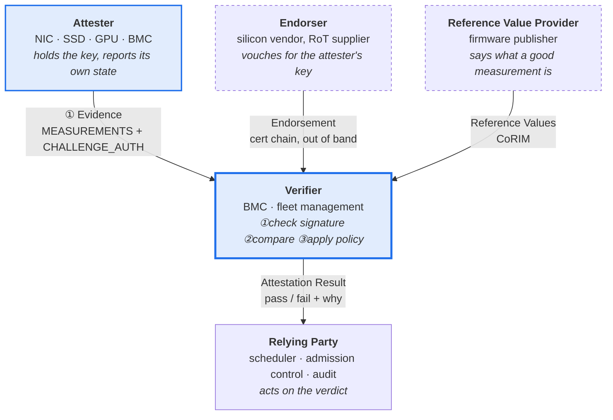

# The RATS roles, and the part SPDM does not cover

RFC 9334 (Remote ATtestation procedureS Architecture) names five roles. The
reason to draw them before writing any code is that it makes one thing obvious
that is otherwise easy to miss for a long time:

> **SPDM covers exactly one of the arrows below. The rest is the verifier's
> problem, and the specification has nothing to say about it.**

That gap is what this project is about.

**SPDM standardises arrow ① and nothing else.** It defines how the attester
proves possession of a key and how it transports a measurement. It is silent
on:

- where the reference values come from,
- what "matches" means when a measurement and a reference value differ,
- what a verifier should do about a mismatch,
- and who is allowed to act on the answer.

## Why that matters, stated plainly

A completed SPDM handshake proves this:

> *The measurement value `a3f9…` genuinely came from the device holding the
> private key for this certificate chain, and it was not modified in transit.*

It does **not** prove:

> *`a3f9…` is the right value.*

Those are different claims, and only the first one has a reference
implementation. Everything that turns the first claim into the second — the
reference values, the comparison, the policy, the verdict — has to be built,
and that is where this project spends its effort:

| Step | Who owns it | Where in this repo |
|---|---|---|
| obtain evidence over SPDM | DMTF reference implementation | `harness/` (G1) |
| show that tampering changes the evidence | this project | `device/`, [`docs/tamper.md`](tamper.md) — **done 2026-09-01** |
| hold reference values | this project | `rats/` (G3) |
| compare and decide | this project | `rats/` policy (G3) |
| assert the decision in CI | this project | `.github/workflows/` (G6) |

The last row is the one worth defending in conversation. A table of results can
be anything. **A CI job that turns red when a tampered measurement is *not*
rejected is the reason the table can be believed.**

## The second row is now measured, and it says more than it was asked to

The claim above — that SPDM covers exactly one arrow of the diagram and the
rest has to be built — was an argument from the specification until
2026-09-01. It is now an observation.

One byte of a device's own measurement was changed and **the handshake
completed, with every signature verifying**
([`tamper.md` §3](tamper.md)). Nothing in the protocol compared the value
against anything, because there is nothing in the protocol to compare it
against: the requester holds a trust anchor for the *certificate* chain,
given out of band, and holds no equivalent for a *measurement*.

So the row "hold reference values" is not scheduled work that would be nice to
have. It is the row without which the row above it has no consequence — and
`bench/data/w4-tamper-*/t1_meas` is a capture of exactly that having no
consequence.

## Mapping onto a real machine

| RATS role | In a datacentre server | In this project |
|---|---|---|
| Attester | NIC, SSD, GPU, or an ERoT chip beside them | `spdm_responder_emu` |
| Verifier | the BMC | `spdm_requester_emu` plus the policy in `rats/` |
| Endorser | the silicon vendor's PKI | the self-signed chain built in W03 |
| Reference Value Provider | the firmware publisher's release metadata | reference values authored here (G3) |
| Relying Party | scheduler, admission control, audit trail | the CI assertion (G6) |

The substitutions in the right-hand column are the honest limitation of an
emulator-based project, and they are stated wherever a result depends on them
rather than only here.

## Two boundaries this project does not cross

1. **Endorsement is assumed, not established.** A real verifier must decide
   whether it trusts the certificate chain it was handed, which means a real
   root of trust and a real PKI. Here the chain is self-signed and its trust is
   asserted by configuration. Every conclusion that depends on chain validity
   inherits that assumption.

2. **Freshness is bounded by the challenge nonce.** SPDM's `CHALLENGE` proves
   the device was present and holding the key *at the moment it signed*. It does
   not prove the firmware did not change one second later. Continuous
   attestation is a different problem and is not attempted here.

## Check yourself before W02

If these cannot be answered from memory, redraw the diagram rather than
rereading it — the diagram is only worth the reasoning behind it.

1. A handshake completes and returns a measurement. Name two distinct reasons
   the machine still might not be safe to schedule work onto.
2. Which arrow does the `CHALLENGE` message belong to, and what exactly does
   the nonce in it rule out?
3. The Endorser and the Reference Value Provider are drawn as separate roles.
   Give a concrete case where they are the same organisation, and one where
   they must not be.
4. A measurement does not match its reference value. List every explanation
   other than "the firmware was tampered with", and say how you would tell
   them apart.

> Question 4 is the one that matters. Treating any mismatch as an attack is how
> an attestation system becomes something operators route around — and a system
> that has been routed around provides no security at all.

---

*Drawn from RFC 9334. Confirm the role names against the RFC itself before
quoting them anywhere they will be checked.*
