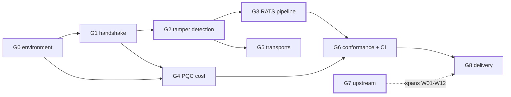

# Roadmap

Fourteen weeks, nine gates, running 2026-08-11 to 2026-11-15. This is the
technical plan the repository is executed against, so that a half-finished
directory reads as scheduled rather than abandoned.

Anything not yet built is absent from the repository rather than sketched in
it. The status column below is the honest one; `README.md` carries the same
table and the two are kept in step.

## Gates

| Gate | Weeks | Subject | Definition of done | Status |
|:--|:--|---|---|---|
| **G0** | 1 | environment and version baseline | two pinned builds; health check passes items 4 and 7; `docs/env-baseline.md` committed | **complete** |
| **G1** | 2–3 | full handshake, field by field | every field of six message pairs annotated from a capture, in my own words | **in progress** — seven pairs annotated in `docs/handshake-walkthrough.md`, 128 values asserted against their captures by CI, and two pairs whose *offsets* are reconstructed from the wire rather than transcribed. The remaining five are named in §10 |
| **G2** | 3–5 | certificate chain and three tamper points | three-layer self-signed chain accepted by the responder; three tamper points; **Table 1** with captures | not started |
| **G3** | 5–7 | RATS verification pipeline | reference values → policy → verdict; clean passes, tampered fails; four version-rollback cases | not started |
| **G4** | 7–8 | post-quantum cost | **Table 2** and **Figure 2**: bytes and round trips, classical vs post-quantum, algorithm confirmed from the negotiated result rather than the requested one | not started |
| **G5** | 9 | real transports | handshake over a transport that is not a TCP socket | not started |
| **G6** | 10–11 | conformance and negative testing | upstream responder validator run with a root cause for every failure; negative tests reproducing three 2026 advisory *classes* | not started |
| **G7** | 1–12 | upstream contribution | a change submitted to an upstream project, with reviewer correspondence | environment prepared; **two candidates with evidence** — `openbmc/spdm` prerequisites, and `DMTF/spdm-emu` help text that disagrees with its own defaults |
| **G8** | 12–14 | delivery and write-up | README, limitations, threat scope, demo, one-page summary | not started |

## Dependencies

G2, G3 and G7 are load-bearing. If time runs short the order of sacrifice is
G5 first, then the fuzzing half of G6, then the extra algorithm groups in G4.
Those three are not on the list.

## Deliverables

| # | Artifact | Gate | Kind |
|:--|---|:--:|---|
| 1 | field-by-field handshake annotation | G1 | written from captures |
| 2 | three-layer self-signed certificate chain + `openssl x509 -text` output | G2 | reproducible |
| 3 | **Table 1** — three tamper points, before/after, with three captures | G2 | measured |
| 4 | `pcapstat.py` — capture statistics, written here, no dependencies | G2 | tool |
| 5 | **Table 2** — post-quantum cost at four levels | G4 | measured |
| 6 | **Figure 2** — total handshake bytes and certificate round trips | G4 | measured |
| 7 | reference values, policy, and verdicts | G3 | reproducible |
| 8 | upstream responder-validator report, root cause per failure | G6 | reproducible |
| 9 | negative test suite reproducing three advisory classes | G6 | reproducible |
| 10 | CI that re-runs the experiments and asserts the published numbers | G6 | mechanism |
| 11 | an upstream change with reviewer correspondence | G7 | external |
| 12 | `docs/threat-scope.md` — what is and is not defended against | G8 | written |
| 13 | `docs/limitations.md` | G8 | written |
| 14 | eight C drills with a compile-error trend | all | separate track |

Deliverable 10 is the one the rest depends on for credibility. A table can be
anything. A CI job that turns red when a tampered measurement is *not* rejected
is the reason a table can be believed, and it is why the assertion is written
as a negative: the pipeline must **fail** on tampered input, and CI checks that
it does.

## Standing rules

1. **Nothing unmeasured is published.** Every number points at a capture and a
   `manifest.json`.
2. **Not the best run.** Byte counts are deterministic and reported as single
   values; anything timing-related is reported as median and p95 over a stated
   number of runs.
3. **Protocol validation is not security assessment**, in those words, wherever
   the distinction could be blurred.
4. **No extrapolation.** A figure computed from a specification rather than
   observed is labelled as computed, beside the figure and not only in a
   footnote.
5. **Limitations sit next to the result**, not in a closing section.
6. **Versions are recorded**, by commit hash, automatically.
7. **Nothing is cited that has not been checked** against the primary source.
8. **Independent variables are verified, not assumed, and enumerated rather
   than spot-checked.** When an algorithm is requested, the result reports what
   was actually negotiated — in *every* direction the protocol negotiates
   separately. Confirming one field of a pair is not confirming the variable;
   2026-08-17 in `LOG.md` is what that costs.
9. **A published number is marked up so a machine can re-derive it.** Prose has
   no equivalent of `prov_begin`, so where a document states a measured value it
   carries a claim comment and `harness/fields.py --check` recomputes it from
   the capture on every CI run. Facts that are only stated are the ones that rot.
10. **An ignore rule does not outrank a manifest.** Every artifact a manifest
    attests to must be present and tracked, and `verify_repo.sh` checks it.
11. **A check is worth what it rejects, and something has to prove it rejects.**
    Every mechanism here has a companion that feeds it something wrong and
    requires it to fail: `pcapcount.py` against a capture built byte by byte,
    `fields.py --check` against a drifted number and an invented field name, the
    layout reconstruction against a message one byte short. A check that has
    never been observed failing is arithmetic that happens to agree.
12. **A number no document quotes is not checked by that document's checker.**
    `--check` guards the values someone chose to state; a tool computing twenty
    fields while seven are quoted is checked on seven, and 2026-08-28 in
    `LOG.md` is what that cost. Where two tools can reach the same quantity by
    different routes, they are made to agree — `pcapcount.py` owns the capture
    file and never reads a decode, `fields.py` owns the decode and never opens
    a capture, and CI requires their answers to reconcile.

## External dates that do not wait

| Date | Event | Affects |
|---|---|---|
| 2026-08-04 | `libspdm 4.0.0-rc` — PQC reaches the main line | G0, G4 |
| 2026-08-31 | DMTF SPDM 1.5 hybrid-PQC public review closes | G2 |
| 2026-09-11 | EU CRA reporting obligations take effect | context |
| 2026-11-15 | repository complete | G8 |

The first and second lines are why this project is worth doing in this
particular quarter: large-scale operators have already written SPDM and
post-quantum requirements into procurement baselines, while the standard that
covers the combination is still in review. That gap is temporary.

## This plan will also expire

Its parent was written on 2026-07-27 and was overtaken thirteen days later by
a release. Any version number, date, flag or advisory identifier stated here
should be re-checked against its primary source before being repeated
anywhere it will be examined.
