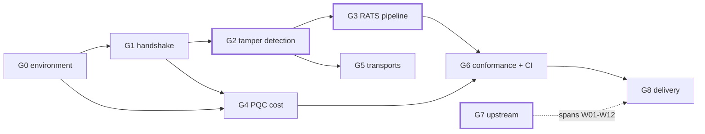

# Roadmap

Fourteen weeks, nine gates, running 2026-08-11 to 2026-11-15. This is the
technical plan the repository is executed against, so that a half-finished
directory reads as scheduled rather than abandoned.

Anything not yet built is absent from the repository rather than sketched in
it. The status column below is the honest one; `README.md` carries the same
table and the two are kept in step.

## Gates

| Gate | Weeks | Subject | Definition of done | Status |
|:--|:--|---|---|---|
| **G0** | 1 | environment and version baseline | two pinned builds; health check passes items 4 and 7; `docs/env-baseline.md` committed | **complete** |
| **G1** | 2–3 | full handshake, field by field | every field of six message pairs annotated from a capture, in my own words | **complete** — seven pairs annotated in `docs/handshake-walkthrough.md`, 164 values asserted against their captures by CI, and four pairs whose *offsets* are reconstructed from the wire rather than transcribed. The three that are not, and why they are harder rather than merely undone, are in §10 |
| **G2** | 3–5 | certificate chain and three tamper points | three-layer self-signed chain accepted by the responder; three tamper points; **Table 1** with captures | **complete** — the chain, a tamper harness running ten controlled arms against a prior baseline, and **Table 1** with all three points measured (`docs/tamper.md`). Point 2 became two arms — the signed content changed in flight, and the signature changed in flight — because they are the pair that fails identically for opposite reasons, which is what the week's plan expected of points 1 and 2 and what point 1 turned out not to do |
| **G3** | 5–7 | RATS verification pipeline | reference values → policy → verdict; clean passes, tampered fails; four version-rollback cases | **complete** — the pipeline exists and is asserted by CI: a capture's measurement record, compared against a COSE-signed reference value under `rats/policy.rego`, over all ten tamper arms (**Table 3**, `docs/rats-pipeline.md`). The arm nothing in SPDM refused is judged FAIL and names the index; the arm where only the *signature* was altered is judged PASS, which separates a damaged link from a damaged device where one status code could not. The fourth clause is closed too: the secure version number is compared per index and one-sided, and four captures — an upgrade, a rollback, an exact match and a correct version beside an altered measurement — are appraised under the new rule **and** under a frozen copy of the equality rule it replaced. Exactly one verdict moves, `rats/test_svn_policy.sh` asserts that it is the only one, and `rats/rats_selftest.py` asserts that the two policies differ in code only inside one marked region. What `>=` still cannot see — a rollback that stays above the reference value — is beside the result in `docs/rats-pipeline.md` §5 |
| **G4** | 7–8 | post-quantum cost | **Table 2** and **Figure 2**: bytes and round trips, classical vs post-quantum, algorithm confirmed from the negotiated result rather than the requested one | **complete** — six algorithm groups arranged as three matched comparisons (classical against post-quantum at NIST categories 3 **and** 5, and lattice against hash-based at a fixed KEM), eighteen control variables pinned, twelve negotiated groups plus four derived facts read back off the wire and asserted per arm. Every ratio is published twice, once per measurement flow, and the gap widens with the security level: 8.99x at category 3 and 10.91x at category 5. Three findings the plan did not ask for: the Version-Capabilities-Algorithms exchange is the same 182 bytes in all six groups — same field widths, different algorithm bits — so nothing post-quantum costs anything to *negotiate*; every signature length in the table falls out of a message-size difference and matches its FIPS constant exactly, which is what says the measurement is calibrated; and `DataTransferSize` — swept over a 32x range on a third build flavour made to have a runtime flag for it — moves the byte total 3.1% while moving round trips from 59 to zero. **Figure 3** is that. The sweep contains its own control: the patched build told to use the unpatched value reproduces every count of its capture — bytes, packets, chunk round trips and the per-message-type table — while the files themselves differ in their nonces, which is the distinction between a deterministic count and reproducible content |
| **G5** | 9 | real transports | handshake over a transport that is not a TCP socket | **complete** — both arms of the post-quantum comparison run over a real Linux MCTP link (**Table 4**, `docs/transports.md` and `docs/fragmentation.md`): real endpoint IDs, a real route table, kernel-allocated tags, and packetisation at DSP0236's 64-byte baseline. **953 post-quantum packets against 115 classical, counted off the wire, and the model reproduces every one.** The packet ratio is 8.29x where the byte ratio is 9.11x, because a transmission unit is charged whole — a distinction no capture over a TCP socket can make. The control is that the same handshakes, recorded at the message layer, are byte-identical to week eight's socket-line captures, so the transport changed nothing about the protocol. Along the way the calibration found that the case this project had been publishing as *the* discriminating length, 177 bytes, discriminates nothing: `59 x 3 = 177`. Second route: an SPDM `GET_VERSION` across a real PCIe DOE mailbox on a QEMU NVMe device, driven from guest userspace because Linux 6.12 has no CMA-SPDM requester. Neither needed the host kernel to change — [ADR 0010](decisions/0010-a-kernel-the-host-does-not-have.md) |
| **G6** | 10–11 | conformance and negative testing | upstream responder validator run with a root cause for every failure; negative tests reproducing three 2026 advisory *classes* | **complete**. Four arms, 1,140 to 1,751 assertions each, and a root cause with a classification for every failure (`docs/validator-report.md`). Three of the four arms exist to make the suite say something other than PASS: one clears a single capability bit and unlocks **611** assertions and four entire test groups, with the capability delta read back off both captures and required to be that one bit in every negotiated version; one reaches the responder through an inert proxy and must reproduce the baseline exactly; and one flips the last byte of a measurement signature in flight and must move **exactly one** assertion, the one named `response signature`. Two upstream findings, and the second is the strongest this project has: the suite's four `CHALLENGE_AUTH` failures are its own test case freeing the certificate chain its setup fetched, and `harness/challenge_verify.py` **proves** the disputed signatures good after calibrating on the nine the suite accepts. Fuzzing and coverage are done and honest (`docs/negative-tests.md`): 312 deduplicated seeds from this project's own captures against upstream's 81, measured with `afl-showmap` rather than asserted — and on three targets this project's corpus reaches **fewer** edges than upstream's single hand-written seed. 11,432 executions at 9.07 per second, no crashes, and the arithmetic showing why that is the expected result rather than a lucky one. 69.7% line coverage, 76.5% of the responder handlers. **W11 closed the other half**: the three advisory classes are written as tests, 24 cases against **21 deliberately wrong implementations**, each of which must be caught by exactly the cases its own file declared in advance — rule 13 turned from a discipline into a build failure — plus two runs asserting what AddressSanitizer does and does not report. All three advisory identifiers were checked against their primary sources and all three are correct; **none is in GitHub's global advisory database, two have no CVE, and the one CVE is in neither NVD nor MITRE's CVE Services**. Whether this project's own builds carry the defects is a separate question answered separately, five ways per advisory, and one of the two flavors is **AFFECTED** (`docs/advisories.md`) |
| **G7** | 1–12 | upstream contribution | a change submitted to an upstream project, with reviewer correspondence | **in progress — both changes sent, awaiting review.** **Both prepared changes were submitted on 2026-09-22**: [`DMTF/spdm-emu` #524](https://github.com/DMTF/spdm-emu/pull/524) by GitHub pull request, DCO green, reviewers assigned by CODEOWNERS; and [`openbmc/spdm` 94773](https://gerrit.openbmc.org/c/openbmc/spdm/+/94773) by Gerrit, patchset 1. Each got its own freshness check in the hour before its push and **each check changed what was sent** — a second rebase for the first, a reinstall of two vanished linters for the second. What remains for this gate is the half nobody controls: a reply. Before that: environment prepared; **seventeen candidates with evidence** — `openbmc/spdm` prerequisites, `DMTF/spdm-emu` help text that disagrees with its own defaults, and two found on 2026-09-01 while explaining a tamper capture: a discarded slot-0 certificate read result, and a requester that never inspects `LIBSPDM_STATUS_VERIF_NO_AUTHORITY`. A fifth arrived on 2026-09-10 while writing the tamper proxy: `spdm_emu_common/command.h` documents the socket payload as "SPDM message, starting from SPDM_HEADER" when the MCTP transport puts a message-type byte in front of it, so a reader who trusts the comment is one byte out on every field. Seven more came from running DMTF's own published example on 2026-09-12, and a thirteenth on 2026-09-14 while pinning an A/B's control variables: `--req_asym NONE --req_pqc_asym NONE` parses, echoes back and then makes the handshake impossible, because the responder requires exactly one requester signature algorithm whenever `MUT_AUTH_CAP` is supported and `--mut_auth NO` does not clear that capability bit. Separately, DMTF's SPDM 1.5 hybrid-PQC review was read during its window and feedback drafted; **not sent**, and filed as evidence of timing rather than of contribution. Four more arrived on 2026-09-14 while building a transport sweep: `--cap` is parsed by the requester and never read, every invalid argument exits **0**, no signed operation completes with SLH-DSA on a build that ships its sample certificates, and `DataTransferSize` has no runtime flag — for which a 55-line patch with a control now exists. Seventeen in total. Two more arrived on 2026-09-20 from running the official conformance suite: `spdm-emu`'s validator configuration array and the `SPDM-Responder-Validator` submodule it configures disagree in both directions — three implemented cases are never requested, including the only two that test SPDM 1.3, and one requested case does not exist and prints nothing at all — and the suite itself reports a **valid** signature as FAIL in every case whose message mask omits `GET_CERTIFICATE`, because the case's own `libspdm_init_connection` frees the chain its setup fetched. The second is proved rather than argued. **Nineteen in total**, and on the same day both prepared changes were re-checked against an upstream that has not moved. Two of the nineteen are now sent; the other seventeen stay recorded with their reproductions rather than bundled, because six unrelated fixes in a first pull request is how a first pull request does not land. ★★ **The first review came back in 35 minutes** and corrected a research conclusion this project had written down: OpenBMC's AI-assistant policy exists, in review at `openbmc/docs` 89452 and 404 on `master`, so a grep over the merged tree could not see it. Answered the same day; the change already conformed. Neither change is merged and both threads are unresolved, so the gate stays open. |
| **G8** | 12–14 | delivery and write-up | README, limitations, threat scope, demo, one-page summary | not started |

## Dependencies

G2, G3 and G7 are load-bearing. If time runs short the order of sacrifice is
G5 first, then the fuzzing half of G6, then the extra algorithm groups in G4.
Those three are not on the list.

## Deliverables

| # | Artifact | Gate | Kind |
|:--|---|:--:|---|
| 1 | field-by-field handshake annotation | G1 | written from captures |
| 2 | three-layer self-signed certificate chain, read from its DER rather than from a pretty-printer | G2 | evidence — [ADR 0005](decisions/0005-generated-inputs-are-evidence.md) says why it is not reproducible |
| 3 | **Table 1** — three tamper points, before/after, with three captures | G2 | measured — two of three; `docs/tamper.md` |
| 4 | `pcapstat.py` — capture statistics, written here, no dependencies | G2 | tool — exists, and CI requires it to agree with `fields.py` per message type |
| 5 | **Table 2** — post-quantum cost at four levels | G4 | measured — **six of six groups**, three matched comparisons, `docs/pqc-cost.md`. Every ratio is re-derived from its captures by `harness/check_claims.py`, and every signature length by subtracting a message's fixed part from it |
| 6 | **Figure 2** — handshake bytes by phase and round trips, and **Figure 3** — DataTransferSize against both | G4 | measured — `harness/mkfigures.py --check` re-renders both and requires the committed SVG to be byte-identical |
| 7 | **Table 3** — reference values, policy, and a verdict per arm | G3 | reproducible — `rats/`, `docs/rats-pipeline.md`, and the four rollback cases beside it under two policies |
| 8 | upstream responder-validator report, root cause per failure | G6 | reproducible — **done**, `docs/validator-report.md`. Four arms, eight failures rooted and classified, and two of the six root causes turned out to be upstream's rather than this responder's |
| 9 | negative test suite reproducing three advisory classes | G6 | reproducible — **done.** `negative/` holds three tests, **24 cases and 21 defect variants**; every case is moved by at least one defect, every defect must be caught by exactly the cases its file predicted, and a defect that moves an unpredicted case fails the build as loudly as one that moves nothing. Each file cites a pinned advisory. `docs/negative-tests.md` §6 |
| 10 | CI that re-runs the experiments and asserts the published numbers | G6 | mechanism — the `rats` job asserts that a **tampered** measurement is rejected and that the version rule moved exactly one verdict; `harness/check_claims.py` re-derives every published cross-capture ratio from the captures it names, at a tolerance of zero; the `negative` job builds and runs every declared defect variant; and a fifth job, `upstream`, runs **weekly rather than on every push** and checks that the tags the pins name still resolve to the commits the pins record, that libspdm still builds at that commit, and that the three advisories have not been edited since they were pinned |
| 11 | an upstream change with reviewer correspondence | G7 | **both halves exist, 2026-09-22, and neither is finished** — the change exists twice, [`DMTF/spdm-emu` #524](https://github.com/DMTF/spdm-emu/pull/524) and [`openbmc/spdm` 94773](https://gerrit.openbmc.org/c/openbmc/spdm/+/94773), and the correspondence exists once: two inline comments from a reviewer 35 minutes after the push, both answered the same day, two threads still unresolved and nothing merged. The external clock is why this gate started in week one, and it is still the thing that decides when it closes |
| 12 | `docs/threat-scope.md` — what is and is not defended against | G8 | written — the day-one outline is still there, with libspdm's own five-layer threat model and the implementation-layer section added on 2026-09-20. The row that matters is level 2: **nothing in this project has ever established a secure session**, and it took a fuzz corpus to notice |
| 13 | `docs/limitations.md` | G8 | written — **skeleton only.** The six layers are settled and the entries that are already known are in it; every place a limitation is known to exist and has not yet been written down precisely is marked `TODO(W12)` and left blank rather than filled with something plausible. It is not claimed as complete and G8 is not started 
| 14 | eight C drills with a compile-error trend | all | separate track |
| 15 | **Table 4** — MCTP packets per handshake, observed on a real link, against the model | G5 | measured — `docs/fragmentation.md` §3a; the calibration beside it reports how many of its lengths actually separate the model from the plausible wrong one |

Deliverable 10 is the one the rest depends on for credibility. A table can be
anything. A CI job that turns red when a tampered measurement is *not* rejected
is the reason a table can be believed, and it is why the assertion is written
as a negative: the pipeline must **fail** on tampered input, and CI checks that
it does.

## Standing rules

1. **Nothing unmeasured is published.** Every number points at a capture and a
   `manifest.json`.
2. **Not the best run.** Byte counts are deterministic and reported as single
   values; anything timing-related is reported as median and p95 over a stated
   number of runs.
3. **Protocol validation is not security assessment**, in those words, wherever
   the distinction could be blurred.
4. **No extrapolation.** A figure computed from a specification rather than
   observed is labelled as computed, beside the figure and not only in a
   footnote.
5. **Limitations sit next to the result**, not in a closing section.
6. **Versions are recorded**, by commit hash, automatically.
7. **Nothing is cited that has not been checked** against the primary source.
8. **Independent variables are verified, not assumed, and enumerated rather
   than spot-checked.** When an algorithm is requested, the result reports what
   was actually negotiated — in *every* direction the protocol negotiates
   separately. Confirming one field of a pair is not confirming the variable;
   2026-08-17 in `LOG.md` is what that costs.
9. **A published number is marked up so a machine can re-derive it.** Prose has
   no equivalent of `prov_begin`, so where a document states a measured value it
   carries a claim comment and `harness/fields.py --check` recomputes it from
   the capture on every CI run. Facts that are only stated are the ones that rot.
10. **An ignore rule does not outrank a manifest.** Every artifact a manifest
    attests to must be present and tracked, and `verify_repo.sh` checks it.
11. **A check is worth what it rejects, and something has to prove it rejects.**
    Every mechanism here has a companion that feeds it something wrong and
    requires it to fail: `pcapcount.py` against a capture built byte by byte,
    `fields.py --check` against a drifted number and an invented field name, the
    layout reconstruction against a message one byte short. A check that has
    never been observed failing is arithmetic that happens to agree.
12. **A number no document quotes is not checked by that document's checker.**
    `--check` guards the values someone chose to state; a tool computing twenty
    fields while seven are quoted is checked on seven, and 2026-08-28 in
    `LOG.md` is what that cost. Where two tools can reach the same quantity by
    different routes, they are made to agree — `pcapcount.py` owns the capture
    file and never reads a decode, `fields.py` owns the decode and never opens
    a capture, `certs/check_chain.py` owns the certificate files and never
    opens either, and CI requires their answers to reconcile.
13. **Two breaks caught by the same check are one check.** Rule 11 requires
    every mechanism to be observed rejecting something. That is not enough on
    its own: a suite where four broken inputs are all refused by the cheapest
    check reports four times the coverage it has, and one of the checks between
    them has still never done anything. So the negative tests assert that the
    rejections come through *distinct* mechanisms, and 2026-08-31 in `LOG.md`
    is the day that assertion found a redundant check in the suite that had
    just been written to demonstrate the rule.
14. **A generated input is evidence, and regenerating it is not reproducing
    it.** Some artifacts are neither captures nor derivations: the certificate
    chain is an *input* the captures depend on, and it cannot be reproduced —
    fresh keys, and an ECDSA signature whose DER length depends on its own
    integers. It is committed, the generator refuses to overwrite it, and what
    has to hold on any machine is the *relationship* rather than the bytes.
    [ADR 0005](decisions/0005-generated-inputs-are-evidence.md).
15. **A drill whose failure mode cannot occur teaches a superstition.** Before a
    C drill is committed, its tests are compiled **three** ways in a scratch
    directory: against the committed stub, which must build and fail; against a
    correct implementation, which must pass; and against the wrong one the
    drill exists to teach, which must be caught. Twice a drill has been written
    whose trap could not fire — 2026-08-28's `d1` and 2026-08-31's first `d6` —
    and both times reasoning about whether it would fire was the same reasoning
    that produced it. The first of the three was added to this rule on
    2026-09-01, after `d4` passed the two interesting compilations and failed
    the boring one: `make` builds every drill, so a stub that does not compile
    turns the badge red on the day it is committed. `c-drills/README.md` had
    described all three from the beginning; this rule had not.
16. **A category is not a prefix of a sentence.** Rule 13 requires distinct
    breaks to be refused by distinct checks, and something has to decide what
    "distinct" means. Comparing the refusal *messages* is not enough: on
    2026-09-01 two broken measurement records were caught by the same length
    test and passed the distinctness check anyway, because the two sentences
    differed in a number they had interpolated. Every mechanism that has to
    report *which* check rejected something returns a stable code beside the
    prose — `ms_status_t` in `device/`, `why_kind` in `fields.py` — and the
    tests compare codes.
17. **An instrument reports its own losses, or its output is not a
    measurement.** Two runs of the same experiment on 2026-09-18 returned
    different packet counts, and neither difference was in the thing being
    measured: an `AF_PACKET` socket silently discarded 33 packets under a
    burst, and a capture began two thirds of the way through because a `sleep`
    was standing in for a synchronisation. Both produced a plausible number
    rather than an error, and the first visible symptom of the second was a
    page of complaints about the *link*. So every capture here now reads the
    kernel's own drop counter and fails on a non-zero value, announces
    readiness rather than being slept at, and is cross-checked against the
    interface counters for the same window. Rule 13 applies to the pair: the
    counter comparison cannot see a late start and the reassembly check cannot
    see a uniform loss, so both are needed and neither is redundant.
18. **A claim that two things differ has to evaluate both of them.** For three
    weeks `docs/fragmentation.md` and a self-test comment asserted that 177
    bytes was the length separating the right MCTP packet formula from the
    plausible wrong one, because the wrong one "says 4". It says 3: `59 x 3 =
    177`. The self-test never computed the rival — it checked only that the
    right formula gave the right answer, which it would have done at any length
    — so a case chosen to discriminate, and named in print as *the* case that
    discriminates, discriminated nothing. Rival hypotheses are now written as
    code and evaluated, the separation is asserted rather than described, and
    `--observed` reports how many messages in a capture actually separate the
    two so that a run which discriminates nothing says so.
19. **A fix is correct in the state it leaves behind, not in isolation.**
    On 2026-09-12 a one-line change to an upstream verifier was written,
    committed, signed off and one keystroke from being sent. It was right: the
    tool passed a public key where a private scalar goes, so it refused every
    signature. Three lines below, the same function discarded the *return
    value* of `verify_signature()`, which is a bool rather than an exception.
    The two defects masked each other, and the correct fix for the first,
    applied alone, would have turned a verifier that accepts **nothing** into
    one that accepts **anything**.
    It was caught by writing a script to re-run the `Tested:` claims of a
    commit message that already existed — and the last claim, *"a corrupted
    signature is still refused"*, was false. So: **before sending a change,
    run its own commit message**, and when a defect is found in a function,
    read the rest of the function rather than the rest of the line.
    `rats/interop.sh` now keeps a half-patched copy of that file and asserts
    that it accepts a forged signature, because the story is not the
    mechanism; the check is.

20. **A test that did not run is not a test that failed, and only the text
    distinguishes them.** Week ten met the same shape five times in one day and
    it was a different disguise each time. DMTF's conformance suite records
    `NOT_TESTED` and counts it in neither half of its own footer, so 1,077 PASS
    and 8 FAIL describes 1,085 of 1,140 assertions. Three of its cases print
    `- skipped` because a configuration array does not name them, and a fourth
    prints **nothing at all** because the configuration names a case the library
    does not implement. `test_spdm_fips` exits non-zero saying *"valid only when
    LIBSPDM_FIPS_MODE is open"*, and `test_spdm_sample` exits non-zero saying it
    cannot open a fixture — neither is a failing assertion. And sixty-nine fuzz
    targets in a GCC build answer `file error` to being run with no argument,
    which the first version of `harness/run_coverage.sh` counted as six broken
    unit tests.
    None of these is distinguishable from a real failure by an exit status, a
    count, or a colour. Each one is distinguishable by **reading what it said**.
    So every tool here that reports a suite reports the three outcomes
    separately, `harness/validator_report.py` refuses a log whose footer and
    lines disagree, and the exclusion of fuzz targets from a unit-test run is
    taken from the source tree rather than from a pattern in a name.

## External dates that do not wait

| Date | Event | Affects |
|---|---|---|
| 2026-08-04 | `libspdm 4.0.0-rc` — PQC reaches the main line | G0, G4 |
| 2026-08-31 | DMTF SPDM 1.5 hybrid-PQC public review closes | G2 |
| 2026-09-11 | EU CRA reporting obligations take effect | context |
| 2026-11-15 | repository complete | G8 |

The first and second lines are why this project is worth doing in this
particular quarter: large-scale operators have already written SPDM and
post-quantum requirements into procurement baselines, while the standard that
covers the combination is still in review. That gap is temporary.

## This plan will also expire

Its parent was written on 2026-07-27 and was overtaken thirteen days later by
a release. Any version number, date, flag or advisory identifier stated here
should be re-checked against its primary source before being repeated
anywhere it will be examined.
